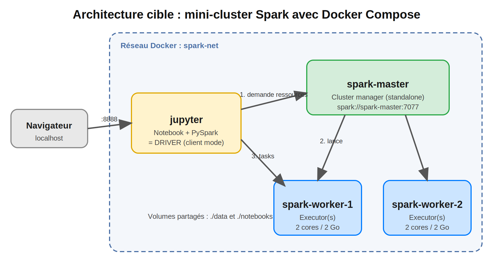
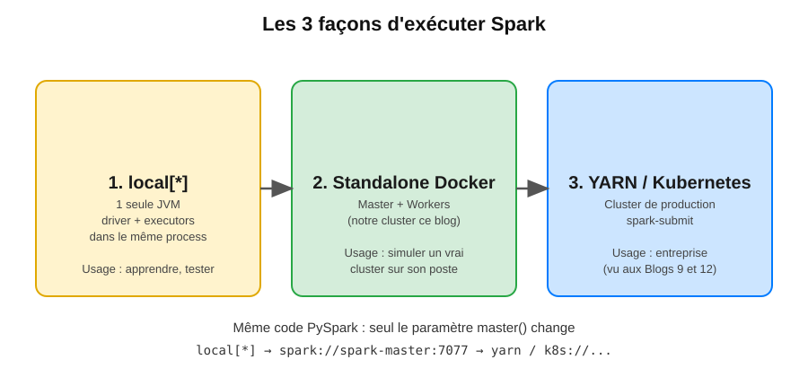
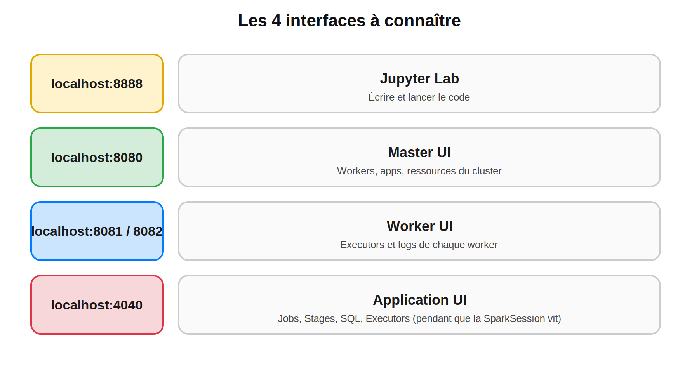

## Environnement de travail : Docker Compose, PySpark et ta première SparkSession

> **Niveau 1 : Fondations** | 
> **Temps de lecture :** ~15 min | **Prérequis :** Blog 1, Docker Desktop (ou Docker Engine + Compose v2), 8 Go de RAM libres

#Spark #ApacheSpark #PySpark #Docker #DockerCompose #Jupyter #DataEngineering #BigData #SparkDeZeroAExpert

---

## Sommaire

1. Ce qu'on construit
2. Trois façons d'exécuter Spark
3. Option A : PySpark en local (sans Docker)
4. Option B : mini-cluster avec Docker Compose
5. Lancer et vérifier le cluster
6. Première SparkSession dans le notebook
7. Les 4 interfaces à connaître
8. Pièges fréquents
9. Exercice final
10. Prochain blog

---

## 1. Ce qu'on construit

À la fin de ce blog, tu auras un **mini-cluster Spark reproductible** sur ton poste, identique en logique à un vrai cluster (un master, des workers, un driver), plus un notebook pour écrire du PySpark.



Lecture du schéma :
1. Le notebook (**driver**, en client mode) demande des ressources au **master**.
2. Le master démarre des **executors** sur les workers.
3. Le driver envoie les **tasks** directement aux executors.

C'est exactement le modèle du Blog 1 (driver + executors), mais en miniature.

---

## 2. Trois façons d'exécuter Spark



| Mode | `master` | Quand |
|---|---|---|
| Local | `local[*]` | Apprendre l'API, tests unitaires |
| Standalone (Docker) | `spark://spark-master:7077` | Simuler un cluster, voir les executors travailler |
| YARN / Kubernetes | `yarn` / `k8s://...` | Production |

Le code PySpark reste le même, seul `.master(...)` change.

---

## 3. Option A : PySpark en local (sans Docker)

Le plus rapide pour démarrer. Prérequis : **Java 17** (ou 11) et **Python 3.9+**.

```bash
java -version                 # doit afficher 11 ou 17
python -m venv .venv && source .venv/bin/activate
pip install pyspark==3.5.3 jupyterlab
```

Test minimal :

```python
from pyspark.sql import SparkSession

spark = SparkSession.builder.master("local[*]").appName("test").getOrCreate()
spark.range(5).show()
```

> `local[*]` = utilise tous les cœurs de ta machine, dans **une seule JVM**. Ici le driver et les executors sont le même process : pratique, mais ce n'est pas un cluster. D'où l'option B.

---

## 4. Option B : mini-cluster avec Docker Compose

### 4.1 Arborescence du projet

```
spark-lab/
├── docker-compose.yml
├── data/            # fichiers de données (partagés avec les workers)
└── notebooks/       # tes notebooks (persistés)
```

```bash
mkdir -p spark-lab/data spark-lab/notebooks && cd spark-lab
```

### 4.2 Solution

<details>
<summary>Voir le docker-compose.yml complet</summary>

```yaml
x-spark-worker: &worker
  image: apache/spark:3.5.3
  command: /opt/spark/bin/spark-class org.apache.spark.deploy.worker.Worker spark://spark-master:7077
  environment:
    SPARK_WORKER_CORES: 2
    SPARK_WORKER_MEMORY: 2g
  volumes:
    - ./data:/data
  depends_on:
    - spark-master
  networks:
    - spark-net

services:
  spark-master:
    image: apache/spark:3.5.3
    hostname: spark-master
    command: /opt/spark/bin/spark-class org.apache.spark.deploy.master.Master
    ports:
      - "8080:8080"
      - "7077:7077"
    volumes:
      - ./data:/data
    networks:
      - spark-net

  spark-worker-1:
    <<: *worker
    hostname: spark-worker-1
    ports: ["8081:8081"]

  spark-worker-2:
    <<: *worker
    hostname: spark-worker-2
    ports: ["8082:8081"]

  jupyter:
    image: quay.io/jupyter/pyspark-notebook:spark-3.5.3
    hostname: jupyter
    ports:
      - "8888:8888"
      - "4040:4040"
    environment:
      JUPYTER_TOKEN: spark
    volumes:
      - ./notebooks:/home/jovyan/work
      - ./data:/data
    depends_on:
      - spark-master
    networks:
      - spark-net

networks:
  spark-net:
    driver: bridge
```

</details>

### 4.4 Pourquoi ces choix ?

| Choix | Raison |
|---|---|
| Même version Spark partout (`3.5.3`) | Driver et cluster doivent avoir la **même version** |
| `hostname` explicite | Les executors doivent pouvoir **joindre le driver** par son nom |
| Volume `./data:/data` sur **tous** les services | Les executors lisent les fichiers : le chemin doit exister partout |
| Réseau `spark-net` | Les conteneurs se résolvent par nom de service |
| 2 workers × 2 cœurs × 2 Go | Assez pour voir le parallélisme, léger pour un laptop |

---

## 5. Lancer et vérifier le cluster

```bash
docker compose up -d
docker compose ps
```

Tous les services doivent être `running`. Puis ouvre :

- **http://localhost:8080** : Master UI. Tu dois voir **2 workers** en état `ALIVE`, soit 4 cores et 4 Go au total.
- **http://localhost:8888/?token=spark** : Jupyter.

Si un worker n'apparaît pas :

```bash
docker compose logs spark-worker-1
```

Arrêter / nettoyer :

```bash
docker compose down        # arrête
docker compose down -v     # arrête + supprime les volumes anonymes
```

---

## 6. Première SparkSession dans le notebook

Dans Jupyter, crée un notebook dans `work/` et complète ce squelette.

### 6.1 Squelette

```python
from pyspark.sql import SparkSession

spark = (
    SparkSession.builder
    .appName("blog2-premiere-session")
    .master("spark://spark-master:7077")
    .config("spark.driver.host", "jupyter")
    .config("spark.driver.bindAddress", "0.0.0.0")
    .config("spark.executor.memory", "1g")
    .config("spark.cores.max", "4")
    .getOrCreate()
)

print(spark.version)                          # 3.5.3
print(spark.sparkContext.master)              # spark://spark-master:7077
print(spark.sparkContext.defaultParallelism)  # 4
```

</details>

### 6.2 Ce qui vient de se passer

1. `getOrCreate()` démarre le **driver** (JVM, via Py4J) dans le conteneur `jupyter`.
2. Le driver s'enregistre auprès du **master** et demande des ressources (`cores.max`, `executor.memory`).
3. Le master lance des **executors** sur les workers.
4. Retourne sur http://localhost:8080 : ton app apparaît dans **Running Applications**.

### 6.3 Un premier job distribué

```python
df = spark.range(10_000_000)                      # transformation (rien ne s'exécute)
result = df.selectExpr("id % 10 AS k").groupBy("k").count()   # transformation

result.show()                                     # ACTION : le job démarre ici
```

Pendant l'exécution, ouvre **http://localhost:4040** : tu vois le job, ses stages et ses tasks. `groupBy` est une *wide dependency*, donc **2 stages** séparés par un shuffle (on détaillera au Blog 10).

### 6.4 Lire un fichier partagé

Dépose un CSV dans `./data/` (ex. `ventes.csv`), puis :

```python
df = spark.read.option("header", True).option("inferSchema", True).csv("/data/ventes.csv")
df.printSchema()
df.show(5)
```

> Le chemin `/data/...` fonctionne car le volume est monté sur **tous** les conteneurs. Sans cela, les executors ne trouveraient pas le fichier (`FileNotFoundException`).

### 6.5 Toujours arrêter la session

```python
spark.stop()
```

Sinon l'application garde ses cores et bloque les suivantes sur le cluster (cf. Blog 12, allocation des ressources).

---

## 7. Les 4 interfaces à connaître



| URL | Ce qu'on y regarde |
|---|---|
| `:8888` | Écrire le code |
| `:8080` | Santé du cluster : workers, cores, applications |
| `:8081` / `:8082` | Logs et executors par worker |
| `:4040` | **La plus utile** : Jobs, Stages, SQL, Executors (n'existe que tant que la SparkSession est active) |

---

## 8. Pièges fréquents

| Symptôme | Cause probable | Solution |
|---|---|---|
| `Initial job has not accepted any resources` | Demande > ressources dispo, ou une ancienne session occupe les cores | `spark.stop()` ailleurs, réduire `cores.max` / `executor.memory` |
| Executors qui ne se connectent pas au driver | `spark.driver.host` manquant ou faux | Mettre le nom du service notebook (`jupyter`) |
| `FileNotFoundException` sur un fichier existant | Volume monté seulement sur le notebook | Monter `./data:/data` sur master **et** workers |
| Erreurs de sérialisation / version | Versions Spark ou Python différentes entre notebook et cluster | Pinner les versions des images ; le **Python minor** doit être identique si tu utilises des UDF Python (Blog 7) |
| Port déjà utilisé | Autre service sur 8080 / 8888 | Changer le port côté hôte (`"9090:8080"`) |
| Mémoire saturée | Trop de ressources demandées | Réduire `SPARK_WORKER_MEMORY` |

> Vérifie les tags d'images (`apache/spark`, `quay.io/jupyter/pyspark-notebook`) avant de les figer : les images évoluent et la compatibilité de versions est le premier point à contrôler.

---

## 9. Exercice final

Sans regarder le blog, écris :
1. Un `docker-compose.yml` avec **1 master + 3 workers** (1 core, 1 Go chacun).
2. Une SparkSession qui s'y connecte avec `spark.cores.max=3`.
3. Un job qui compte les lignes de `spark.range(50_000_000)` et vérifie sur `:4040` combien de **tasks** ont été lancées.

**Question :** pourquoi le nombre de tasks dépend-il du nombre de partitions, et pas du nombre de workers ? *(Réponse au Blog 10.)*

---

## Points clés

1. `local[*]` = une seule JVM, pratique pour apprendre ; un cluster Docker = vrai modèle driver/master/workers.
2. Même version de Spark partout, et `spark.driver.host` pour que les executors joignent le driver.
3. Les fichiers doivent être accessibles **depuis tous les executors** (volume partagé).
4. `:8080` pour le cluster, `:4040` pour l'application.
5. Les transformations sont lazy ; l'**action** (`show`, `count`, `write`) lance le job.
6. Toujours `spark.stop()` pour libérer les ressources.

---

## 10. Prochain blog

Ton cluster tourne et tu sais lancer un job. Mais jusqu'ici on a utilisé `spark.range()` et des DataFrames sans vraiment demander : **qu'est-ce qu'un DataFrame ? En quoi diffère-t-il d'un RDD ?** Pourquoi `spark.range(10_000_000)` ne consomme-t-il pas de mémoire avant l'action ?


---


#Spark #ApacheSpark #PySpark #Docker #DockerCompose #Jupyter #LearnSpark #DataEngineer #SparkDeZeroAExpert