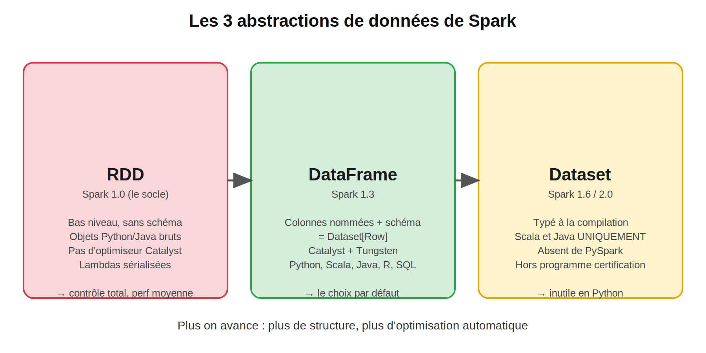
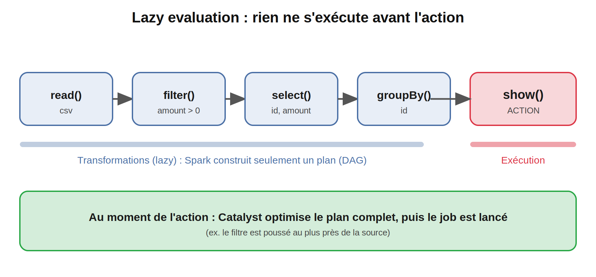
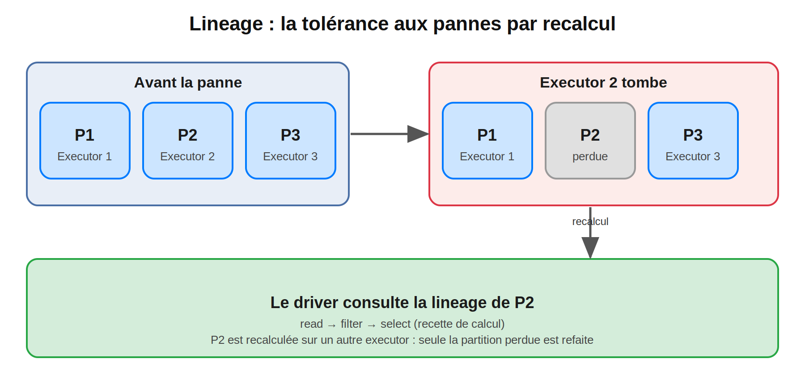

## RDD, DataFrame, Dataset : les abstractions de données de Spark

>  **Niveau 1 : Fondations** | Blog 3 
> **Temps de lecture :** ~15 min | **Prérequis :** Blogs 1 et 2 (cluster Docker opérationnel)

#Spark #ApacheSpark #PySpark #RDD #DataFrame #Dataset #LazyEvaluation #Lineage #DataEngineering #BigData #SparkDeZeroAExpert

---

## Sommaire

1. Rappel : la question laissée au Blog 2
2. Les trois abstractions
3. RDD : le socle
4. DataFrame : le choix par défaut
5. Dataset : pourquoi il n'existe pas en PySpark
6. Lazy evaluation
7. Immutabilité
8. Lineage et tolérance aux pannes
9. Partitions : le lien avec le parallélisme
10. Quand utiliser quoi
11. Questions type certification
12. Prochain blog

---

## 1. Rappel : la question laissée au Blog 2

> *Pourquoi `spark.range(10_000_000)` ne consomme-t-il pas de mémoire avant l'action ?*

Parce que `spark.range(...)` ne **crée aucune donnée** : il crée un **plan**. Les 10 millions de lignes sont générées partition par partition, au moment de l'action, dans les executors. Tout ce blog repose sur cette idée.

---

## 2. Les trois abstractions



| | RDD | DataFrame | Dataset |
|---|---|---|---|
| Niveau | Bas | Haut | Haut |
| Schéma | Non | **Oui** (colonnes nommées + types) | Oui |
| Optimiseur Catalyst | ❌ | ✅ | ✅ |
| Typage compile-time | Non | Non | ✅ |
| Python (PySpark) | ✅ | ✅ | ❌ |
| Scala / Java | ✅ | ✅ | ✅ |

Un DataFrame est en réalité un `Dataset[Row]` : un Dataset dont les lignes sont génériques.

---

## 3. RDD : le socle

**RDD** = *Resilient Distributed Dataset* :
- **Distributed** : découpé en partitions réparties sur les executors
- **Resilient** : récupérable après une panne grâce à la lineage
- **Immutable** : on ne le modifie jamais, on en crée un nouveau

Un RDD ne connaît **pas la structure** de ses données : pour Spark, ce sont des objets opaques. Il ne peut donc pas les optimiser.

### 3.1 Squelette : word count en RDD

<details>

```python
sc = spark.sparkContext

lines = sc.parallelize(["spark est rapide", "spark est distribué", "spark est lazy"], 3)

counts = (
    lines
    .flatMap(lambda l: l.split(" "))
    .map(lambda w: (w, 1))
    .reduceByKey(lambda a, b: a + b)
)

print(counts.collect())
# [('spark', 3), ('est', 3), ('rapide', 1), ('distribué', 1), ('lazy', 1)]  (ordre variable)
```

</details>

### 3.2 Le coût caché en PySpark

Les `lambda` d'un RDD sont du **code Python** : elles s'exécutent dans des **Python workers** côté executor (cf. Blog 1, section PySpark/JVM). Chaque ligne est sérialisée entre la JVM et Python. C'est la raison principale pour laquelle le RDD est plus lent que le DataFrame en PySpark.

---

## 4. DataFrame : le choix par défaut

Un **DataFrame** est une table distribuée : des **lignes**, des **colonnes nommées** et un **schéma**.

Parce que Spark connaît la structure, il peut :
- vérifier les colonnes et les types **avant** l'exécution (`AnalysisException`)
- optimiser le plan avec **Catalyst** (Blog 11)
- gérer la mémoire de façon compacte avec **Tungsten**
- exécuter les opérations **dans la JVM**, sans passer par Python

### 4.1 Squelette : le même word count en DataFrame


```python
from pyspark.sql import functions as F

df = spark.createDataFrame([("spark est rapide",), ("spark est distribué",), ("spark est lazy",)], ["line"])

(
    df
    .select(F.explode(F.split("line", " ")).alias("word"))
    .groupBy("word")
    .count()
    .show()
)
```

</details>

### 4.2 Schéma explicite

```python
from pyspark.sql.types import StructType, StructField, StringType, IntegerType

schema = StructType([
    StructField("id", IntegerType(), nullable=False),
    StructField("pays", StringType(), nullable=True),
])

df = spark.createDataFrame([(1, "MA"), (2, "FR")], schema)
df.printSchema()
```

```
root
 |-- id: integer (nullable = false)
 |-- pays: string (nullable = true)
```

### 4.3 Passer de l'un à l'autre

```python
rdd = df.rdd                              # DataFrame -> RDD de Row
df2 = rdd.toDF(["id", "pays"])            # RDD -> DataFrame
df3 = spark.createDataFrame(rdd, schema)  # avec schéma explicite
```

---

## 5. Dataset : pourquoi il n'existe pas en PySpark

Le **Dataset** ajoute le **typage à la compilation** (un `Dataset[Client]` en Scala sait que chaque ligne est un `Client`). Ce mécanisme repose sur le système de types de Scala/Java.

Python étant dynamiquement typé, **l'API Dataset n'existe pas en PySpark**. Spark recommande de toute façon les DataFrames, qui couvrent pratiquement tous les besoins, et la certification n'inclut pas de questions sur les Datasets.

> **À retenir :** en PySpark, tu choisis entre **DataFrame** (par défaut) et **RDD** (cas particuliers).

---

## 6. Lazy evaluation



Spark distingue deux familles d'opérations :

| Type | Effet | Exemples |
|---|---|---|
| **Transformation** | Ajoute une étape au plan, **ne calcule rien** | `select`, `filter`, `withColumn`, `groupBy`, `join` |
| **Action** | **Déclenche** l'exécution | `show`, `count`, `collect`, `take`, `write` |

Les transformations se subdivisent en **narrow** (chaque partition se traite seule : `filter`, `select`) et **wide** (redistribution des données, donc shuffle : `groupBy`, `join`). On y reviendra en détail au Blog 10.

### Pourquoi c'est un avantage

Comme Spark voit **tout le plan avant d'exécuter**, il peut l'optimiser globalement (filtrer plus tôt, ne lire que les colonnes utiles, fusionner des opérations) au lieu d'exécuter chaque ligne naïvement.

### Expérience à faire

```python
df = spark.range(100_000_000)                         # instantané
df2 = df.filter("id % 2 = 0").selectExpr("id * 2 AS x")   # instantané

df2.count()                                           # le job démarre ici
```

Ouvre http://localhost:4040 : le job n'apparaît qu'au moment du `count()`.

### `cache()` est lui aussi lazy

```python
df2.cache()      # ne met rien en mémoire pour l'instant
df2.count()      # 1re action : calcule ET met en cache
df2.count()      # 2e action : lit depuis le cache
df2.unpersist()
```

---

## 7. Immutabilité

Un DataFrame (ou RDD) **ne change jamais**. Chaque transformation retourne un **nouvel** objet.

```python
df = spark.range(3)
df2 = df.withColumn("double", df.id * 2)

df.printSchema()    # id seulement
df2.printSchema()   # id + double
```

Erreur classique :

```python
df.withColumn("double", df.id * 2)     # ❌ résultat jeté, df n'a pas changé
df = df.withColumn("double", df.id * 2)  # ✅ on réassigne
```

Cette immutabilité est ce qui rend possible la lineage, donc la tolérance aux pannes.

---

## 8. Lineage et tolérance aux pannes



Chaque RDD/DataFrame mémorise **comment il a été produit** : c'est sa **lineage** (la recette). Si un executor tombe et que des partitions sont perdues, le driver **recalcule uniquement ces partitions** sur un autre executor, à partir de la lineage.

Voir la lineage :

```python
print(counts.toDebugString().decode())   # RDD (retourne des bytes en PySpark)
df2.explain()                            # plan d'un DataFrame
```

Ordre de défense face à une panne :
1. **Lineage** : recalcul des partitions perdues
2. **Driver** : relance des tasks échouées
3. **Cluster manager** : alloue de nouveaux conteneurs si besoin

> ⚠️ Les données stockées sur le disque d'un worker mort ne sont **pas récupérables** : c'est le **recalcul** qui sauve, pas la copie.

---

## 9. Partitions : le lien avec le parallélisme

Un RDD/DataFrame est découpé en **partitions**. **1 partition = 1 task** lors d'un stage (Blog 10).

```python
spark.range(0, 1000, 1, 8).rdd.getNumPartitions()   # 8
sc.parallelize(range(100), 3).getNumPartitions()    # 3
spark.sparkContext.defaultParallelism               # 4 avec notre cluster (cores.max=4)
```

| Partitions | Conséquence |
|---|---|
| Trop peu | Cœurs inutilisés, partitions énormes |
| Trop | Surcoût de scheduling, petites tasks |

Règle de départ : au moins autant de partitions que de cœurs, souvent 2 à 4 fois plus. On l'affinera au Blog 13.

---

## 10. Quand utiliser quoi

| Situation | Choix |
|---|---|
| Données structurées/semi-structurées (CSV, JSON, Parquet, tables) | **DataFrame** |
| SQL, jointures, agrégations, windows | **DataFrame** |
| Besoin de performance | **DataFrame** |
| Données non structurées avec logique très personnalisée | RDD |
| Contrôle fin du partitionnement (partitioner personnalisé) | RDD |
| Code legacy déjà en RDD | RDD (migrer si possible) |

**Règle simple :** DataFrame d'abord. RDD seulement si tu peux justifier pourquoi le DataFrame ne suffit pas.

---

## 11. Questions type certification

**Q1. Quelle affirmation est correcte ?**
- A. Un DataFrame est modifiable sur place → ❌ immutable
- B. Les transformations déclenchent immédiatement l'exécution → ❌ c'est le rôle des actions
- C. L'API Dataset est disponible en PySpark → ❌ Scala/Java uniquement
- D. Une action déclenche l'exécution du plan → ✅

**Q2. Combien de jobs ?**
```python
df = spark.read.parquet("/data/x")   # souvent 0 job (schéma lu dans les métadonnées)
df2 = df.filter("a > 1").select("a")
df2.count()
df2.show()
```
→ **2 jobs** minimum (`count` et `show`). 1 action = 1 job.

**Q3. Que contient la lineage ?**
→ La suite de transformations qui permet de **recalculer** une partition perdue.

**Q4. Pourquoi les DataFrames sont-ils plus rapides que les RDD en PySpark ?**
→ Catalyst optimise le plan et l'exécution reste dans la JVM, sans sérialisation vers Python.

---

## Points clés

1. **DataFrame par défaut**, RDD en cas particulier, **Dataset absent de PySpark**.
2. Un DataFrame a un **schéma** : Spark l'utilise pour valider et optimiser.
3. **Lazy evaluation** : les transformations construisent un plan, l'**action** l'exécute. 1 action = 1 job.
4. **Immutabilité** : chaque transformation retourne un nouvel objet, il faut réassigner.
5. **Lineage** : la tolérance aux pannes se fait par **recalcul** des partitions perdues.
6. **1 partition = 1 task** : le nombre de partitions pilote le parallélisme.
7. `cache()` est lazy, comme le reste.

---

## 12. Prochain blog

Tu sais maintenant ce qu'est un DataFrame et pourquoi son **schéma** est si précieux. Mais jusqu'ici, nos données venaient de `spark.range()` ou de listes Python. En vrai, elles viennent de fichiers : CSV, JSON, Parquet, tables.

Et c'est là que ça se complique :
- pourquoi `inferSchema` déclenche-t-il un **job supplémentaire** ?
- pourquoi un fichier **Parquet** est-il tellement plus rapide qu'un CSV ?
- que se passe-t-il quand on écrit dans un dossier qui existe déjà ?


---

#Spark #ApacheSpark #PySpark #RDD #DataFrame #LazyEvaluation #LearnSpark #DataEngineer #SparkDeZeroAExpert
