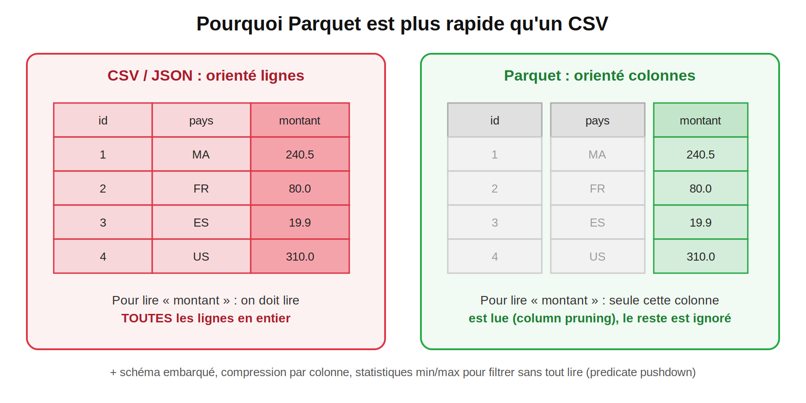
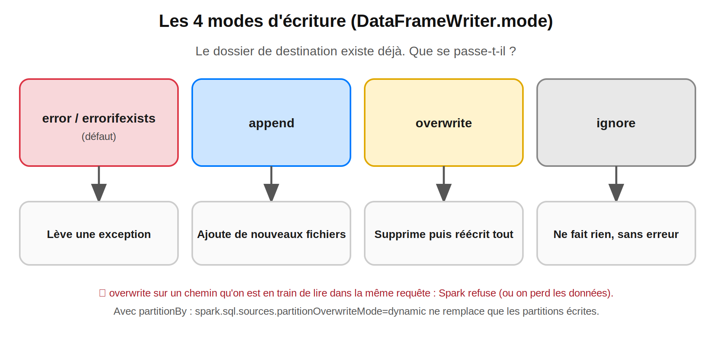
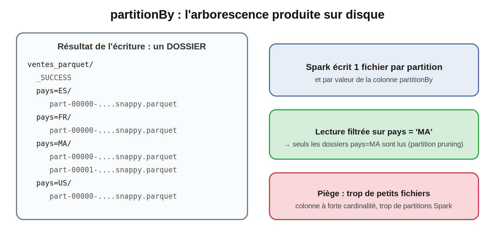

## Lecture et écriture de données : CSV, JSON, Parquet, Delta, schémas et modes d'écriture

> **Niveau 2 : Maîtrise de l'API**
> **Temps de lecture :** ~18 min | **Prérequis :** Blogs 1 à 3, cluster Docker du Blog 2

#Spark #ApacheSpark #PySpark #Parquet #Delta #DeltaLake #CSV #JSON #DataEngineering #BigData #ETL #SparkDeZeroAExpert

---

## Sommaire

1. Rappel : les 3 questions du Blog 3
2. L'API de lecture/écriture en un coup d'œil
3. Jeu de données de travail
4. Lire du CSV et maîtriser le schéma
5. Lire du JSON
6. Parquet : le format par défaut en data engineering
7. Delta Lake : Parquet + transactions
8. Écrire : modes, partitionBy, nombre de fichiers
9. Expériences à faire sur ton cluster
10. Pièges fréquents
11. Questions type certification
12. Prochain blog

---

## 1. Rappel : les 3 questions du Blog 3

| Question | Réponse courte | Détail |
|---|---|---|
| Pourquoi `inferSchema` déclenche un job en plus ? | Spark doit **parcourir les données** pour deviner les types | Section 4 |
| Pourquoi Parquet est bien plus rapide qu'un CSV ? | Format **colonnes**, schéma embarqué, compression, filtres poussés | Section 6 |
| Que se passe-t-il si le dossier de sortie existe déjà ? | Par défaut : **erreur** | Section 8 |

---

## 2. L'API de lecture/écriture en un coup d'œil

```python
# LECTURE : spark.read  -> DataFrameReader
df = (
    spark.read
    .format("csv")                 # csv, json, parquet, orc, delta, jdbc...
    .option("header", True)        # options propres au format
    .schema(schema)                # schéma explicite (recommandé)
    .load("/data/ventes.csv")
)

# ÉCRITURE : dwrite -> DataFrameWriter
(
    dwrite
    .format("parquet")
    .mode("overwrite")             # error | append | overwrite | ignore
    .partitionBy("pays")
    .save("/data/out/ventes")
)
```

Raccourcis équivalents : `spark.read.csv(path)`, `spark.read.json(path)`, `spark.read.parquet(path)`, `dwrite.parquet(path)`.

| Format | Orientation | Schéma | Lisible humain | Usage typique |
|---|---|---|---|---|
| **CSV** | Lignes | ❌ (à fournir/deviner) | ✅ | Échanges, fichiers sources |
| **JSON** | Lignes | ❌ (deviné) | ✅ | APIs, logs, semi-structuré |
| **Parquet** | **Colonnes** | ✅ embarqué | ❌ | Data lake, stockage analytique |
| **ORC** | Colonnes | ✅ | ❌ | Écosystème Hive |
| **Delta** | Colonnes (Parquet) + log | ✅ | ❌ | Data lake fiable (ACID) |

Autres sources : **JDBC** (bases relationnelles), **Kafka** (Blog 14), stockage objet (`s3a://`, `abfss://`, `gs://`) avec le même code, seul le chemin change.

> **Rappel du Blog 2 :** les executors lisent et écrivent eux-mêmes. Le chemin `/data/...` doit donc exister sur **tous** les conteneurs (volume partagé).

---

## 3. Jeu de données de travail

On génère 1 million de ventes directement dans Spark. Ce code est un outil de setup, pas un exercice.

```python
from pyspark.sql import SparkSession
from pyspark.sql import functions._
spark = (
    SparkSession.builder
    .appName("blog4-io")
    .master("spark://spark-master:7077")
    .config("spark.driver.host", "jupyter")
    .config("spark.driver.bindAddress", "0.0.0.0")
    .config("spark.executor.memory", "1g")
    .config("spark.cores.max", "4")
    .getOrCreate()
)

ventes = (
    spark.range(1_000_000)
    .select(
        col("id").alias("vente_id"),
        (col("id") % 1000).cast("int").alias("client_id"),
        element_at(
            array(lit("MA"), lit("FR"), lit("ES"), lit("US")),
            (col("id") % 4 + 1).cast("int"),
        ).alias("pays"),
        round(rand(42) * 500, 2).alias("montant"),
        date_add(lit("2025-01-01").cast("date"), (col("id") % 365).cast("int")).alias("date_vente"),
    )
)

ventes.printSchema()
ventes.show(3)
```

---

## 4. Lire du CSV et maîtriser le schéma

### 4.1 Écrire un CSV de test

```python
(ventes.write.mode("overwrite").option("header", True).csv("/data/out/ventes_csv"))
```

> Le résultat est un **dossier** (`ventes_csv/`) contenant des fichiers `part-*.csv`, pas un fichier unique. Voir section 8.

### 4.2 Les options CSV à connaître

| Option | Rôle | Défaut |
|---|---|---|
| `header` | 1re ligne = noms de colonnes | `false` |
| `inferSchema` | Deviner les types | `false` (tout en `string`) |
| `sep` | Séparateur | `,` |
| `quote` / `escape` | Guillemets / échappement | `"` / `\` |
| `multiLine` | Champ sur plusieurs lignes | `false` |
| `nullValue` | Chaîne à traiter comme `null` | vide |
| `dateFormat` / `timestampFormat` | Formats de dates | ISO |
| `mode` | Gestion des lignes corrompues | `PERMISSIVE` |

### 4.3 `inferSchema` : pratique mais coûteux

```python
df = spark.read.option("header", True).option("inferSchema", True).csv("/data/out/ventes_csv")
```

Avec `inferSchema`, Spark fait **une première passe sur les données** pour deviner les types, puis une seconde pour les lire vraiment. Sur de gros volumes, c'est cher, et les types devinés peuvent changer d'un fichier à l'autre (un `int` devenu `string` à cause d'une ligne sale).

Observe-le dans **http://localhost:4040**, onglet *Jobs* : le `read` avec `inferSchema` lance un job qui parcourt les données, ce que ne fait pas la lecture avec schéma explicite.

### 4.4 Squelette : lire avec un schéma explicite

Deux écritures possibles. Complète les deux de mémoire.

```python

from pyspark.sql.types import (
    StructType, StructField, LongType, IntegerType, StringType, DoubleType, DateType
)

schema = StructType([
    StructField("vente_id", LongType(), False),
    StructField("client_id", IntegerType(), True),
    StructField("pays", StringType(), True),
    StructField("montant", DoubleType(), True),
    StructField("date_vente", DateType(), True),
])

schema_ddl = "vente_id LONG, client_id INT, pays STRING, montant DOUBLE, date_vente DATE"

df = (
    spark.read
    .option("header", True)
    .schema(schema)
    .csv("/data/out/ventes_csv")
)
dprintSchema()
```

</details>

### 4.5 Lignes corrompues : le paramètre `mode`

| `mode` | Comportement |
|---|---|
| `PERMISSIVE` (défaut) | Garde la ligne, met `null` dans les champs invalides |
| `DROPMALFORMED` | Supprime les lignes invalides en silence |
| `FAILFAST` | Échoue dès la première ligne invalide |

En `PERMISSIVE`, tu peux **récupérer** les lignes rejetées en ajoutant une colonne `_corrupt_record STRING` au schéma : elle contiendra la ligne brute des enregistrements invalides. Utile pour auditer la qualité des données sources.

---

## 5. Lire du JSON

Par défaut, Spark attend du **JSON Lines** : un objet JSON **par ligne**.

```json
{"id": 1, "pays": "MA", "tags": ["a", "b"]}
{"id": 2, "pays": "FR", "tags": []}
```

```python
df = spark.read.json("/data/events.json")                    # JSON Lines
df = spark.read.option("multiLine", True).json("/data/x.json")   # un tableau [...] ou JSON indenté
```

| Point | À retenir |
|---|---|
| Schéma | Deviné par défaut en parcourant les données : fournis-le en production |
| Objets imbriqués | Deviennent des `struct` : accès par `col("adresse.ville")` |
| Tableaux | Deviennent des `array` : `explode()` pour les aplatir (Blog 5) |
| Fichier non JSON Lines | Sans `multiLine=true`, lignes corrompues ou vides |

---

## 6. Parquet : le format par défaut en data engineering



| Avantage | Effet |
|---|---|
| **Colonnes** | Seules les colonnes demandées sont lues (*column pruning*) |
| **Schéma embarqué** | Pas d'`inferSchema`, pas d'ambiguïté de types |
| **Compression** par colonne | Fichiers plus petits (snappy par défaut) |
| **Statistiques min/max** | Des blocs entiers peuvent être ignorés (*predicate pushdown*) |
| Fichier **splittable** | Lu en parallèle par plusieurs tasks |

```python
ventes.write.mode("overwrite").parquet("/data/out/ventes_parquet")

df = spark.read.parquet("/data/out/ventes_parquet")   # schéma lu dans les métadonnées
dselect("montant").show(3)                          # ne lit que la colonne montant
```

Évolution de schéma entre fichiers : `spark.read.option("mergeSchema", True).parquet(...)`.

**Règle d'or :** CSV/JSON en **entrée** (ce que les sources fournissent), **Parquet ou Delta** pour tout ce que tu produis et relis.

---

## 7. Delta Lake : Parquet + transactions

Delta ajoute à Parquet un **journal de transactions** (`_delta_log/`). Tu gagnes :

| Fonction | Apport |
|---|---|
| **ACID** | Pas de lecture d'un état à moitié écrit |
| **Schema enforcement** | Refuse l'écriture de données au mauvais schéma |
| **Time travel** | Relire une version antérieure de la table |
| **Upserts** | `MERGE INTO`, `UPDATE`, `DELETE` |

### 7.1 Activation sur le cluster

Delta est un **package externe**. Configuration de la SparkSession (à adapter à ta version de Spark) :

```python
spark = (
    SparkSession.builder
    .appName("blog4-delta")
    .master("spark://spark-master:7077")
    .config("spark.driver.host", "jupyter")
    .config("spark.driver.bindAddress", "0.0.0.0")
    .config("spark.jars.packages", "io.delta:delta-spark_2.12:3.2.0")
    .config("spark.sql.extensions", "io.delta.sql.DeltaSparkSessionExtension")
    .config("spark.sql.catalog.spark_catalog", "org.apache.spark.sql.delta.catalog.DeltaCatalog")
    .getOrCreate()
)
```

> ⚠️ La version de `delta-spark` doit correspondre à ta version de Spark (vérifie la matrice de compatibilité de Delta). Le téléchargement du package demande un accès internet depuis le conteneur du notebook. Ce bloc est le premier à vérifier sur ton environnement.

### 7.2 Squelette : écrire et relire en Delta

```python
ventes.write.format("delta").mode("overwrite").save("/data/out/ventes_delta")

df = spark.read.format("delta").load("/data/out/ventes_delta")

df_v0 = spark.read.format("delta").option("versionAsOf", 0).load("/data/out/ventes_delta")
```

</details>

On approfondira Delta (MERGE, optimisation, maintenance) au Blog 14.

---

## 8. Écrire : modes, partitionBy, nombre de fichiers

### 8.1 Les 4 modes d'écriture



```python
dwrite.mode("append").parquet(path)       # ajoute
dwrite.mode("overwrite").parquet(path)    # remplace tout
dwrite.mode("ignore").parquet(path)       # ne fait rien si le chemin existe
dwrite.parquet(path)                      # défaut = errorifexists
```

Pour ne remplacer que les partitions concernées :

```python
spark.conset("spark.sql.sources.partitionOverwriteMode", "dynamic")
dwrite.mode("overwrite").partitionBy("pays").parquet(path)
```

### 8.2 `partitionBy` : organiser le disque



```python
ventes.write.mode("overwrite").partitionBy("pays").parquet("/data/out/ventes_part")
```

| Bon choix de colonne | Mauvais choix |
|---|---|
| Faible cardinalité (pays, année, mois) | `vente_id`, `client_id` (millions de dossiers) |
| Utilisée dans les filtres fréquents | Jamais filtrée |

Lecture avec **partition pruning** :

```python
spark.read.parquet("/data/out/ventes_part").filter("pays = 'MA'").explain()
# cherche : PartitionFilters: [..., (pays = MA)]
```

### 8.3 Combien de fichiers en sortie ?

**1 partition Spark = 1 fichier** (par valeur de `partitionBy`). Rappel Blog 3 : le nombre de partitions pilote le parallélisme.

| Besoin | Outil | Remarque |
|---|---|---|
| Réduire le nombre de fichiers | `coalesce(n)` | **Narrow**, pas de shuffle, peut déséquilibrer |
| Rééquilibrer ou augmenter | `repartition(n)` | **Wide**, shuffle complet |
| Regrouper par colonne avant écriture | `repartition("pays")` | Évite l'éclatement en petits fichiers par dossier |
| Limiter la taille d'un fichier | `.option("maxRecordsPerFile", 500000)` | |

```python
ventes.coalesce(2).write.mode("overwrite").parquet("/data/out/ventes_2files")
```

> `coalesce(1)` donne un seul fichier mais **toute l'écriture passe par une seule task** : à réserver aux petits volumes.

### 8.4 Compression

```python
dwrite.option("compression", "gzip").parquet(path)   # snappy (défaut), gzip, zstd, none
```

`snappy` : rapide, bon compromis. `gzip` / `zstd` : plus compact, plus lent à écrire.

---

## 9. Expériences à faire sur ton cluster

**Expérience 1 : taille des formats**

```python
ventes.write.mode("overwrite").option("header", True).csv("/data/out/ventes_csv")
ventes.write.mode("overwrite").json("/data/out/ventes_json")
ventes.write.mode("overwrite").parquet("/data/out/ventes_parquet")
```

```bash
du -sh data/out/*
```

Compare les trois tailles. Parquet est typiquement bien plus compact.

**Expérience 2 : column pruning et predicate pushdown**

```python
spark.read.parquet("/data/out/ventes_parquet").select("montant").filter("montant > 400").explain()
```

Dans le plan, repère `ReadSchema` (une seule colonne lue) et `PushedFilters`.

**Expérience 3 : le coût d'`inferSchema`**

Lis le CSV avec puis sans `inferSchema`, et compare le nombre de jobs dans `:4040`.

**Expérience 4 : les modes**

Écris deux fois dans le même chemin avec `errorifexists`, puis `append`, puis `overwrite`. Compte les lignes à chaque étape.

---

## 10. Pièges fréquents

| Symptôme | Cause | Solution |
|---|---|---|
| `AnalysisException: Path already exists` | Mode par défaut `errorifexists` | Choisir `overwrite`/`append` explicitement |
| Tout est `string` après lecture CSV | `inferSchema` absent | Schéma explicite |
| Types changeants entre exécutions | `inferSchema` sur données sales | Schéma explicite + colonne `_corrupt_record` |
| JSON : colonne `_corrupt_record` seule | Fichier non JSON Lines | `multiLine=true` |
| Données perdues après `overwrite` | Lecture et écriture sur le **même chemin** | Écrire dans un chemin temporaire puis basculer, ou utiliser Delta |
| Des milliers de petits fichiers | `partitionBy` à forte cardinalité ou trop de partitions Spark | `repartition(col)` / `coalesce`, autre colonne |
| `FileNotFoundException` côté executor | Volume non monté sur les workers | Volume `./data:/data` partout (Blog 2) |
| `Permission denied` ou échec du commit à l'écriture (surtout Linux) | Executors et driver tournent avec des utilisateurs différents sur le dossier partagé | Voir ci-dessous |
| Écriture lente avec un seul fichier | `coalesce(1)` | Garder plusieurs fichiers |

**Piège permissions (lab Docker, Linux).** Dans notre compose, les workers (image `apache/spark`) et le notebook (utilisateur `jovyan`) n'ont pas le même UID. Comme le driver finalise l'écriture en déplaçant des fichiers créés par les executors, il peut échouer sur un dossier partagé. Piste de correction : faire tourner master et workers avec l'UID du notebook et déplacer le répertoire de travail du worker.

```yaml
  spark-worker-1:
    <<: *worker
    user: "1000:100"
    environment:
      SPARK_WORKER_CORES: 2
      SPARK_WORKER_MEMORY: 2g
      SPARK_WORKER_DIR: /tmp/spark-work
```

Je n'ai pas testé cette configuration sur tous les environnements : vérifie d'abord si tu rencontres le problème (Docker Desktop sous macOS/Windows le masque souvent), et adapte les UID/GID à ceux du conteneur `jupyter`.

---

## 11. Questions type certification

**Q1. Quel mode d'écriture échoue si le dossier existe déjà ?**
→ `errorifexists` (défaut). `ignore` ne fait rien sans erreur, `append` ajoute, `overwrite` remplace.

**Q2. Quelle affirmation sur `inferSchema` est correcte ?**
- A. Gratuit, car le schéma est lu dans les métadonnées → ❌ c'est Parquet, pas CSV
- B. Nécessite une passe supplémentaire sur les données → ✅
- C. Garantit des types stables entre exécutions → ❌

**Q3. Combien de fichiers produit `drepartition(8).write.parquet(p)` ?**
→ **8** (un par partition, hors partitions vides), plus `_SUCCESS`.

**Q4. Quel est l'avantage principal de Parquet pour `SELECT montant FROM t` ?**
→ Seule la colonne `montant` est lue (column pruning), et des blocs peuvent être ignorés grâce aux statistiques.

**Q5. `coalesce` vs `repartition` pour réduire de 200 à 10 partitions avant écriture ?**
→ `coalesce(10)` : transformation narrow, pas de shuffle.

---

## Points clés

1. API unique : `spark.read.format().option().schema().load()` et `dwrite.format().mode().save()`.
2. **Schéma explicite** en production : `inferSchema` coûte une passe et peut varier.
3. CSV/JSON pour **recevoir**, **Parquet/Delta** pour **stocker**.
4. Parquet : colonnes, schéma embarqué, compression, pushdown.
5. Delta ajoute ACID, schema enforcement et time travel sur Parquet (package à configurer).
6. Modes : `errorifexists` (défaut), `append`, `overwrite`, `ignore`.
7. `partitionBy` sur une **faible cardinalité** ; surveille le nombre de petits fichiers.
8. La sortie est un **dossier** : 1 partition = 1 fichier.

---

## 12. Prochain blog

Tu sais maintenant charger des données et les écrire proprement. Mais les données réelles sont rarement propres : doublons, valeurs `null`, types incohérents, dates en texte.

Une question à garder en tête : **que devient la moyenne des montants quand 10 % d'entre eux sont `null` ?** Et pourquoi `groupBy` provoque-t-il un shuffle alors que `filter` n'en provoque jamais ?

**👉 Blog 5 : Transformations DataFrame.**
`select`, `filter`, `withColumn`, `groupBy`, `agg`, gestion des `null`, colonnes calculées et fonctions natives. On travaillera sur le jeu de données `ventes` créé dans ce blog.

---


#Spark #ApacheSpark #PySpark #Parquet #DeltaLake #DataEngineering #LearnSpark #DataEngineer #ETL #SparkDeZeroAExpert
