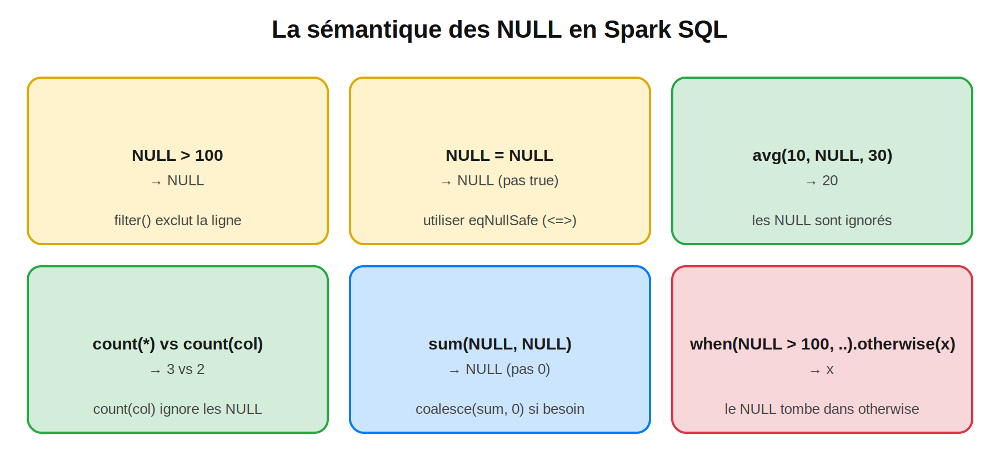
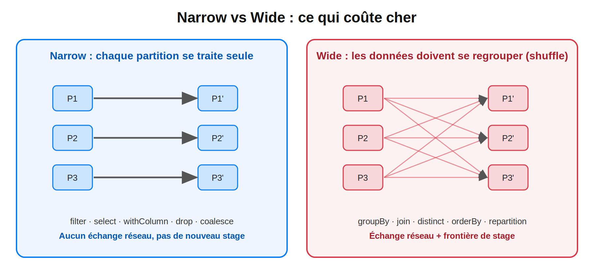
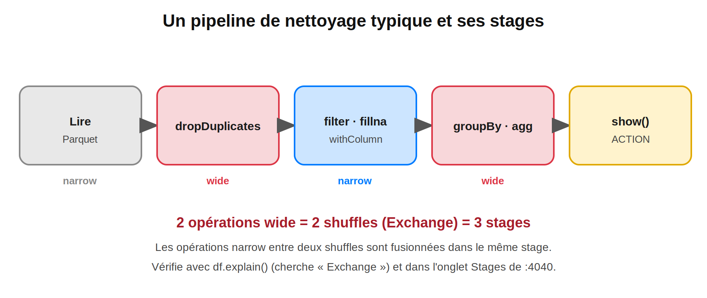

## Transformations DataFrame : select, filter, withColumn, groupBy, agg et gestion des null

> **Niveau 2 : Maîtrise de l'API** 
> **Temps de lecture :** ~20 min | **Prérequis :** Blogs 1 à 4, jeu de données `ventes` (Parquet) du Blog 4

#Spark #ApacheSpark #PySpark #DataFrame #Transformations #GroupBy #NullHandling #DataCleaning #DataEngineering #BigData #SparkDeZeroAExpert

---

## Sommaire

1. Rappel : les 2 questions du Blog 4
2. Jeu de données sale
3. Sélectionner et renommer : `select`, `selectExpr`, `drop`
4. Filtrer : `filter` / `where`
5. Créer des colonnes : `withColumn` et fonctions natives
6. Agréger : `groupBy` et `agg`
7. Les `null` : sémantique et traitements
8. Doublons, tri, limites
9. Narrow vs Wide : le coût de chaque transformation
10. Pipeline de nettoyage complet
11. Pièges fréquents
12. Questions type certification
13. Prochain blog

---

## 1. Rappel : les 2 questions du Blog 4

**Que devient la moyenne quand 10 % des montants sont `null` ?**
Les `null` sont **ignorés** : `avg` calcule la moyenne des valeurs **non nulles**. Ce n'est pas la même chose que de les traiter comme des 0. Détail en section 7.

**Pourquoi `groupBy` provoque un shuffle et pas `filter` ?**
`filter` juge chaque ligne **seule**, donc chaque partition peut travailler indépendamment (*narrow*). `groupBy` doit réunir **toutes les lignes ayant la même clé** au même endroit, ce qui impose de redistribuer les données entre executors (*wide*). Détail en section 9.

---

## 2. Jeu de données sale

On repart du Parquet du Blog 4 et on le **salit volontairement** : des `null` dans `montant` et `pays`, et des doublons. On sauvegarde le résultat pour que tous les blogs suivants travaillent sur les mêmes données.

```python
from pyspark.sql import SparkSession
from pyspark.sql import functions

spark = (
    SparkSession.builder
    .appName("blog5-transformations")
    .master("spark://spark-master:7077")
    .config("spark.driver.host", "jupyter")
    .config("spark.driver.bindAddress", "0.0.0.0")
    .config("spark.executor.memory", "1g")
    .config("spark.cores.max", "4")
    .getOrCreate()
)

base = spark.read.parquet("/data/out/ventes_parquet")

sales = (
    base
    .withColumn("montant", when(rand(1) < 0.10, lit(None).cast("double")).otherwise(col("montant")))
    .withColumn("pays",    when(rand(2) < 0.05, lit(None).cast("string")).otherwise(col("pays")))
)
sales = sales.unionByName(sales.limit(1000))      # ajoute des doublons

sales.write.mode("overwrite").parquet("/data/out/ventes_sales")
sales = spark.read.parquet("/data/out/ventes_sales")
sales.printSchema()
```

---

## 3. Sélectionner et renommer

### 3.1 Les façons de désigner une colonne

```python
sales.select("vente_id")                 # nom (str)
sales.select(col("vente_id"))          # objet Column (le plus flexible)
sales.select(sales["vente_id"])          # via le DataFrame
sales.select(sales.vente_id)             # attribut (fragile si le nom a des espaces)
```

Utilise `col("nom")` par défaut : il fonctionne partout et évite l'ambiguïté lors des jointures (Blog 6).

### 3.2 `select`, `selectExpr`, `drop`, renommage

```python
sales.select(
    "vente_id",
    "pays",
    (col("montant") * 1.2).alias("montant_ttc"),
)

sales.selectExpr("vente_id", "pays", "montant * 1.2 AS montant_ttc")   # syntaxe SQL

sales.drop("client_id")
sales.withColumnRenamed("montant", "montant_ht")
sales.toDF("id", "client", "pays", "montant", "date")                  # renomme toutes les colonnes
```

### 3.3 Changer le type : `cast`

```python
sales.withColumn("montant", col("montant").cast("decimal(10,2)"))
sales.withColumn("client_id", col("client_id").cast("string"))
```

> Un `cast` impossible (ex. `"abc"` en entier) donne `null`, sans erreur. Contrôle les nulls après un cast.

---

## 4. Filtrer

### 4.1 Squelette : conditions

```python
<summary>Solution</summary>

```python
sales.filter((col("pays") == "MA") & (col("montant") > 100))
sales.filter(col("pays").isin(["MA", "FR"]))
sales.filter(col("montant").between(50, 200))
sales.filter(col("pays").isNull())
sales.filter(col("pays") != "US")     # exclut aussi les lignes où pays est NULL !
```

</details>

### 4.2 Règles à retenir

| Règle | Exemple |
|---|---|
| `&`, `\|`, `~` à la place de `and`, `or`, `not` | `(a > 1) & (b < 2)` |
| **Parenthèses obligatoires** autour de chaque condition | `&` est prioritaire sur `>` en Python |
| Tester l'absence avec `isNull()` / `isNotNull()` | pas `== None` |
| `filter` = `where` | alias |
| Chaîne SQL possible | `sales.filter("pays = 'MA' AND montant > 100")` |
| Motifs | `like("M%")`, `rlike("^[A-Z]{2}$")`, `startswith`, `contains` |

---

## 5. Créer des colonnes : `withColumn`

### 5.1 Colonnes calculées et conditions

```python
sales2 = (
    sales
    .withColumn("montant_ttc", round(col("montant") * 1.2, 2))
    .withColumn(
        "tranche",
        when(col("montant").isNull(), "inconnu")
         .when(col("montant") >= 400, "élevé")
         .when(col("montant") >= 100, "moyen")
         .otherwise("faible"),
    )
    .withColumn("annee", year("date_vente"))
    .withColumn("mois", date_format("date_vente", "yyyy-MM"))
    .withColumn("source", lit("boutique"))                # colonne constante
)
```

Plusieurs colonnes d'un coup (Spark 3.3+) :

```python
sales.withColumns({"annee": year("date_vente"), "mois": month("date_vente")})
```

> **Piège :** si on n'avait pas mis le test `isNull()` en premier, un `montant` null tomberait dans `.otherwise("faible")` (voir section 7).

### 5.2 Fonctions natives les plus utiles

| Famille | Fonctions |
|---|---|
| Texte | `upper`, `lower`, `trim`, `concat_ws`, `substring`, `regexp_replace`, `split`, `length` |
| Nombres | `round`, `floor`, `ceil`, `abs`, `greatest`, `least` |
| Dates | `to_date`, `year`, `month`, `dayofweek`, `date_add`, `datediff`, `date_format`, `current_date` |
| Conditions | `when/otherwise`, `coalesce`, `nullif`, `isnull` |
| Collections | `array`, `explode`, `size`, `array_contains`, `collect_list`, `collect_set` |

**Règle d'or :** préfère **toujours** les fonctions natives (`pyspark.sql.functions`) aux UDF Python. Elles restent dans la JVM et sont optimisées par Catalyst (Blogs 7 et 11).

---

## 6. Agréger : `groupBy` et `agg`

### 6.1 Squelette : indicateurs par pays


```python
resultat = (
    sales
    .groupBy("pays")
    .agg(
        count("*").alias("nb_lignes"),
        count("montant").alias("nb_montants"),
        round(avg("montant"), 2).alias("panier_moyen"),
        sum("montant").alias("ca"),
        countDistinct("client_id").alias("nb_clients"),
    )
    .orderBy(col("ca").desc())
)
resultat.show()
```

</details>

### 6.2 Points importants

| Sujet | À retenir |
|---|---|
| Plusieurs clés | `groupBy("pays", "annee")` |
| Agrégation globale | `sales.agg(sum("montant"))` (sans `groupBy`) |
| Les `null` dans la clé | Forment **leur propre groupe** (`pays = null`) |
| `count("*")` vs `count("col")` | Toutes les lignes **vs** les valeurs non nulles |
| `countDistinct` | Exact mais coûteux ; `approx_count_distinct` pour de très gros volumes |
| Collecter des valeurs | `collect_list`, `collect_set` (attention à la taille mémoire) |

### 6.3 Ce que fait vraiment `groupBy`

```python
sales.groupBy("pays").agg(sum("montant")).explain()
```

Dans le plan, tu verras : `HashAggregate (partial)` → **`Exchange`** → `HashAggregate (final)`.

1. Chaque partition **pré-agrège localement** (réduit le volume).
2. Le **shuffle** (`Exchange`) regroupe les résultats partiels par clé.
3. L'agrégation **finale** combine les partiels.

C'est pourquoi `groupBy` + `sum` est bien plus efficace qu'un `collect_list` suivi d'un calcul : le pré-agrégat réduit ce qui traverse le réseau.

---

## 7. Les `null` : sémantique et traitements



Un `null` signifie **« valeur inconnue »**, pas « zéro » ni « vide ». D'où des règles qui surprennent.

### 7.1 Règles logiques

| Expression | Résultat |
|---|---|
| `null > 100` | `null` → la ligne est **exclue** par `filter` |
| `null = null` | `null` (pas `true`) |
| `null <=> null` / `eqNullSafe` | `true` |
| `pays != "US"` | exclut aussi les `pays` null |
| `when(null > 100, ...).otherwise(x)` | retourne `x` |

Pour garder les null dans un filtre « différent de » :

```python
sales.filter((col("pays") != "US") | col("pays").isNull())
sales.filter(~col("pays").eqNullSafe("US"))
```

### 7.2 Règles d'agrégation

| Fonction | Comportement |
|---|---|
| `sum`, `avg`, `min`, `max` | **Ignorent** les null |
| `avg([10, null, 30])` | **20**, pas 13,3 |
| `sum` d'une colonne entièrement null | `null`, pas 0 |
| `count("*")` | Compte toutes les lignes |
| `count("col")` | Compte les valeurs non nulles |

### 7.3 Compter les null par colonne

```python
sales.select([sum(col(c).isNull().cast("int")).alias(c) for c in sales.columns]).show()
```

### 7.4 Squelette : traiter les null

```python
# 1. Remplacer : montant -> 0.0, pays -> "INCONNU"
sales_f = sales.na.fill({"montant": 0.0, "pays": "INCONNU"})

# 2. Supprimer les lignes où montant est null
sales_d = sales.na.drop(subset=["montant"])

# 3. Supprimer les lignes où AU MOINS 2 colonnes sont null
sales.dropna(thresh=2)       # thresh = nb MINIMUM de valeurs non nulles à garder

# 4. Valeur de repli calculée (colonne par colonne)
sales.withColumn("montant_ok", coalesce("montant", lit(0.0)))

# 5. Remplacer par la moyenne
moyenne = sales.agg(avg("montant")).first()[0]
sales_m = sales.fillna({"montant": moyenne})
```


### 7.5 Quel traitement choisir ?

| Stratégie | Quand | Risque |
|---|---|---|
| `dropna` | Donnée inexploitable sans cette valeur | Perte de lignes, biais |
| `fillna(0)` | Absence **signifie** zéro (ex. nb d'achats) | Fausse les moyennes si null = inconnu |
| `fillna(moyenne)` | Analyse statistique | Réduit la variance |
| Garder le `null` | L'information « inconnu » compte | Penser aux agrégations |
| Colonne indicatrice | `withColumn("montant_manquant", col.isNull())` | Aucun, conseillé |

> **Répondre à la question du Blog 4 :** remplacer les null par 0 **baisse** artificiellement la moyenne. Garder les null donne la moyenne des montants **connus**. Le bon choix dépend du sens métier.

### 7.6 `null` vs `NaN`

Pour les colonnes `double`, `NaN` (*not a number*, résultat de `0.0/0.0`) est **différent** de `null`. `isNull()` ne détecte pas `NaN` : utilise `isnan("col")`.

---

## 8. Doublons, tri, limites

```python
sales.distinct()                         # lignes entièrement identiques
sales.dropDuplicates()                   # idem
sales.dropDuplicates(["vente_id"])       # un seul enregistrement par vente_id

sales.orderBy(col("montant").desc())                    # null en dernier par défaut en desc
sales.orderBy(col("montant").desc_nulls_last())         # explicite
sales.limit(10)
sales.take(5)                                             # ACTION : retourne une liste de Row
sales.first()
```

| Point | À retenir |
|---|---|
| `dropDuplicates(subset)` | La ligne conservée parmi les doublons n'est **pas déterministe** : trie ou utilise une window (Blog 6) si ça compte |
| `orderBy` | Tri **global** = shuffle (wide) : à n'utiliser qu'à la fin |
| `limit` | Transformation ; `take`, `first`, `collect` sont des actions |
| `collect()` | Ramène **tout** au driver : jamais sur un gros DataFrame |

---

## 9. Narrow vs Wide : le coût de chaque transformation



| Narrow (pas de shuffle) | Wide (shuffle) |
|---|---|
| `select`, `selectExpr`, `drop`, `withColumn`, `withColumnRenamed` | `groupBy` + agrégation |
| `filter` / `where` | `join` (sauf broadcast) |
| `coalesce` | `distinct`, `dropDuplicates` |
| `map`-like : `explode`, `cast` | `orderBy` / `sort` |
| | `repartition` |

> `limit(n)` n'est pas une dépendance étroite pure : le plan peut rassembler les lignes dans une seule partition (`GlobalLimit`). Vérifie avec `explain()`.

**Pourquoi c'est important ?** Un shuffle écrit sur disque, transfère par le réseau et crée une **frontière de stage** (Blog 10). Réduire le nombre de wide transformations est la première optimisation d'un pipeline.

Test à faire :

```python
sales.filter("montant > 100").select("pays").explain()          # aucun Exchange
sales.groupBy("pays").count().explain()                         # un Exchange
```

---

## 10. Pipeline de nettoyage complet



```python
propre = (
    sales
    .dropDuplicates(["vente_id"])                                     # wide
    .filter(col("date_vente").isNotNull())                          # narrow
    .withColumn("montant_manquant", col("montant").isNull())        # narrow
    .na.fill({"pays": "INCONNU"})                                     # narrow
    .withColumn("annee", year("date_vente"))                        # narrow
)

kpi = (
    propre
    .groupBy("pays", "annee")                                         # wide
    .agg(
        count("*").alias("nb_ventes"),
        round(avg("montant"), 2).alias("panier_moyen"),
        round(sum("montant"), 2).alias("ca"),
    )
    .orderBy("pays", "annee")
)

kpi.show()                                                            # ACTION
```

Structure recommandée : une chaîne par bloc logique, entre parenthèses, une transformation par ligne. Pour réutiliser une étape :

```python
def ajouter_annee(df):
    return dwithColumn("annee", year("date_vente"))

propre = sales.transform(ajouter_annee)
```

Sauvegarde le résultat pour le Blog 6 :

```python
propre.write.mode("overwrite").parquet("/data/out/ventes_propres")
```

---

## 11. Pièges fréquents

| Piège | Pourquoi | Solution |
|---|---|---|
| `dwithColumn(...)` sans réassigner | Immutabilité (Blog 3) | `df = dwithColumn(...)` |
| `filter(a > 1 & b < 2)` | Priorité des opérateurs Python | Parenthèses : `(a > 1) & (b < 2)` |
| `filter(col == None)` | Retourne toujours `null` | `isNull()` |
| `!=` qui « perd » des lignes | Les `null` sont exclus | `eqNullSafe` ou `\| isNull()` |
| `when` sans test de `null` | Les `null` tombent dans `otherwise` | Tester `isNull()` en premier |
| `fillna(0)` partout | Fausse les moyennes | Choisir selon le sens métier |
| `sum` renvoie `null` | Colonne entièrement nulle | `coalesce(sum, 0)` |
| `collect()` sur un gros DataFrame | Tout transite par le driver : OOM | `limit`, `take`, ou écrire en fichier |
| `orderBy` en plein milieu d'un pipeline | Shuffle global inutile | Trier à la fin seulement |
| `dropDuplicates(["id"])` « au hasard » | Ligne conservée non déterministe | Window + `row_number` (Blog 6) |
| UDF Python pour une opération native | Perte d'optimisation | `pyspark.sql.functions` |

---

## 12. Questions type certification

**Q1. Quelle transformation provoque un shuffle ?**
- A. `filter` → ❌ narrow
- B. `select` → ❌ narrow
- C. `groupBy().count()` → ✅ wide
- D. `withColumn` → ❌ narrow

**Q2. Résultat de `avg` sur `[10, null, 30]` ?**
→ **20** : les null sont ignorés.

**Q3. Différence entre `count("*")` et `count("montant")` ?**
→ `count("*")` compte toutes les lignes ; `count("montant")` ignore les null.

**Q4. Combien de stages dans `dropDuplicates → filter → groupBy.agg → show()` ?**
→ **3** : deux wide transformations = deux shuffles, donc trois stages (Blog 10).

**Q5. Quel est le bon test pour détecter une valeur absente ?**
→ `col.isNull()`, jamais `col == None`.

**Q6. `dfilter(col("pays") != "US")` : que devient une ligne où `pays` est null ?**
→ Elle est **exclue** (`null != "US"` vaut `null`).

**Q7. Pourquoi préférer une fonction native à une UDF Python ?**
→ Elle reste dans la JVM et Catalyst peut l'optimiser.

---

## Points clés

1. `select` / `withColumn` / `filter` sont **narrow** ; `groupBy`, `join`, `distinct`, `orderBy` sont **wide**.
2. Utilise `col()` et les **fonctions natives** plutôt que des UD
3. Les `null` signifient **inconnu** : comparaisons à `null`, agrégations qui les ignorent, `otherwise` qui les capte.
4. `count("*")` ≠ `count("col")`.
5. Choisis `dropna`, `fillna` ou conserve le `null` selon le **sens métier**.
6. `groupBy` pré-agrège localement avant le shuffle (`HashAggregate` partiel).
7. 2 wide transformations = 2 shuffles = 3 stages.
8. `dropDuplicates(subset)` n'est pas déterministe sur la ligne conservée.

---

## 13. Prochain blog

Ton jeu de données est propre et tu sais l'agréger. Mais regarde `ventes` : on a un `client_id`, pas le **nom** du client ni sa **ville**. Ces informations vivent dans **une autre table**.

Questions à garder en tête :
- Que fait réellement un `join` ? Pourquoi est-il l'opération la plus coûteuse d'un pipeline ?
- Quelle différence entre `inner`, `left`, `left_semi`, `left_anti` ?
- Comment obtenir « les 3 meilleures ventes **par client** » ou un **cumul glissant**, sans que `groupBy` écrase les lignes ?

**👉 Blog 6 : Joins et Window functions.**
Types de jointures, broadcast join, colonnes ambiguës, puis `row_number`, `rank`, `lag`/`lead`, cumuls et fenêtres glissantes. On travaillera sur `ventes_propres` (Parquet) produit ci-dessus.

---

#Spark #ApacheSpark #PySpark #DataFrame #NullHandling #DataCleaning #LearnSpark #DataEngineer #ETL #SparkDeZeroAExpert