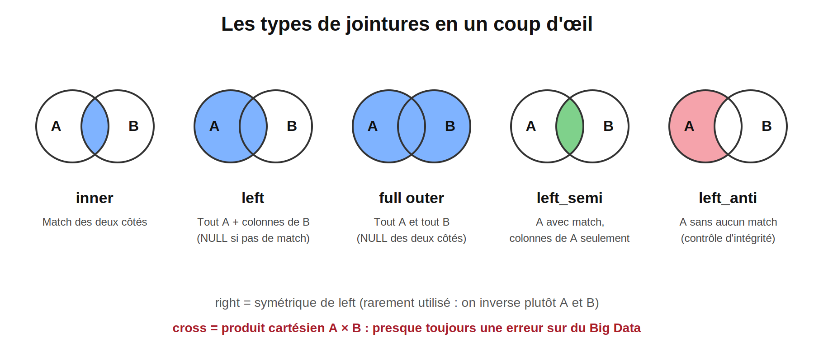
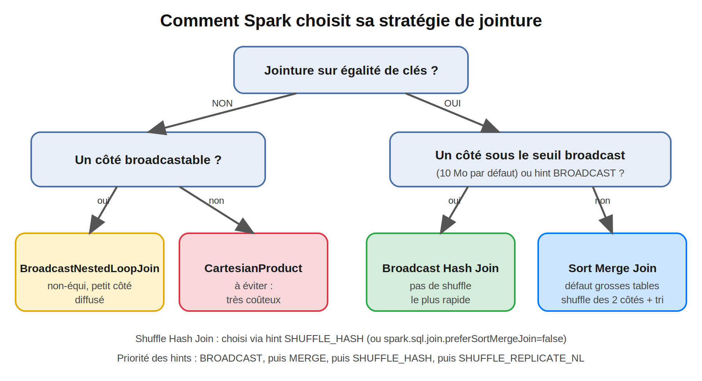
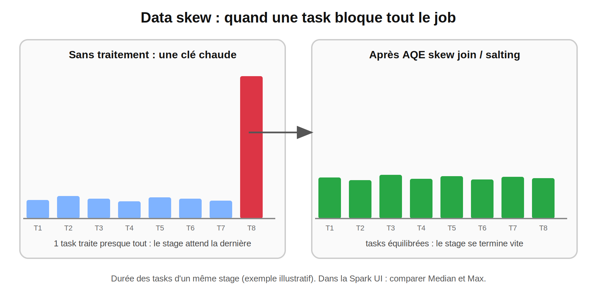
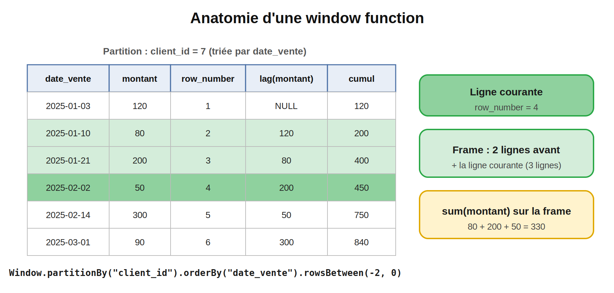

# Spark :
## Joins et Window functions : les problèmes réels du Big Data 

> **Niveau 2 : Maîtrise de l'API** |
> **Temps de lecture :** ~30 min | **Prérequis :** Blogs 1 à 5, 

#Spark #ApacheSpark #PySpark #Joins #WindowFunctions #DataSkew #BroadcastJoin #SortMergeJoin #DataEngineering #BigData #Performance #SparkDeZeroAExpert

---

## Sommaire

1. Rappel : les 3 questions du Blog 5
2. Pourquoi ce blog est différent
3. Données de travail
4. Les types de jointures et leurs usages métier
5. Comment Spark exécute une jointure
6. Les 8 problèmes de jointure en production
7. Data skew : le problème n°1 du Big Data
8. Window functions : les bases
9. Les 7 patterns de window en entreprise
10. Window functions : performance et pièges
11. Cas complet : rapprochement ventes / référentiel clients
12. Checklist avant de mettre une jointure en production
13. Questions type certification
14. Prochain blog

---

## 1. Rappel : les 3 questions du Blog 5

| Question | Réponse courte |
|---|---|
| Que fait réellement un `join` ? Pourquoi est-il si coûteux ? | Il **redistribue les deux tables par clé** (shuffle), les trie, puis rapproche les lignes. Sauf si un côté est assez petit pour être diffusé (broadcast). Sections 5 et 6 |
| Quelle différence entre `inner`, `left`, `left_semi`, `left_anti` ? | Ce que tu gardes des lignes sans correspondance, et les colonnes retournées. Section 4 |
| Comment obtenir « les 3 meilleures ventes **par client** » sans que `groupBy` écrase les lignes ? | Avec une **window function** : elle calcule sur un groupe **sans réduire** le nombre de lignes. Section 8 |

---

## 2. Pourquoi ce blog est différent

En formation, une jointure marche toujours. En entreprise, avec des milliards de lignes, les jointures et les windows sont **la première cause de pannes et de résultats faux**. Les symptômes que tu verras :

- un job bloqué à **199/200 tasks** pendant des heures
- un chiffre d'affaires **gonflé** après un `join`
- des lignes qui **disparaissent** sans erreur
- une `OutOfMemoryError` sur le driver pendant un broadcast
- un résultat différent à chaque exécution

Ce blog suit un fil rouge : **le rapprochement ventes / référentiel clients**, le scénario le plus courant d'un data lake bancaire ou retail. Chaque section part d'un **problème réel**, montre comment le **détecter**, puis comment le **corriger**.

---

## 3. Données de travail

On a déjà `ventes_propres` (Blog 5). On crée la table **clients** (la dimension) avec volontairement des pièges : des clients manquants, une colonne `pays` qui existe aussi dans `ventes`, et des doublons.

```python
from pyspark.sql import SparkSession
from pyspark.sql import functions
from pyspark.sql.window import Window
from pyspark.sql.functions import broadcast

spark = (
    SparkSession.builder
    .appName("blog6-joins-windows")
    .master("spark://spark-master:7077")
    .config("spark.driver.host", "jupyter")
    .config("spark.driver.bindAddress", "0.0.0.0")
    .config("spark.executor.memory", "1g")
    .config("spark.cores.max", "4")
    .getOrCreate()
)

ventes = spark.read.parquet("/data/out/ventes_propres")

clients = (
    spark.range(0, 950)                       # client_id 950 à 999 n'existent PAS : ventes orphelines
    .select(
       col("id").cast("int").alias("client_id"),
       concat(lit("Client_"),col("id").cast("string")).alias("nom"),
       element_at(array(lit("Casablanca"),lit("Rabat"),lit("Paris"),lit("Madrid")),
                     (col("id") % 4 + 1).cast("int")).alias("ville"),
       element_at(array(lit("MA"),lit("FR"),lit("FR"),lit("ES")),
                     (col("id") % 4 + 1).cast("int")).alias("pays"),      # même nom que dans ventes !
       element_at(array(lit("retail"),lit("corporate"),lit("premium")),
                     (col("id") % 3 + 1).cast("int")).alias("segment"),
       date_add(lit("2025-01-01").cast("date"), (col("id") % 100).cast("int")).alias("maj"),
    )
)
clients.write.mode("overwrite").parquet("/data/out/clients")
clients = spark.read.parquet("/data/out/clients")

clients_dup = clients.unionByName(clients.limit(50))   # référentiel « sale » : 50 doublons
```

---

## 4. Les types de jointures et leurs usages métier



| Type | Retourne | Usage métier typique |
|---|---|---|
| `inner` | Lignes avec correspondance des deux côtés | Quand une ligne sans correspondance est **inutilisable** |
| `left` | Tout A, colonnes de B (null si absent) | **Enrichissement** : on ne perd jamais une vente |
| `full outer` | Tout A et tout B | **Réconciliation** entre deux sources |
| `left_semi` | Lignes de A **ayant** un match, colonnes de A seulement | « Ventes des clients premium » (filtre, sans dupliquer) |
| `left_anti` | Lignes de A **sans** match | **Contrôle d'intégrité**, chargement incrémental |
| `cross` | Produit cartésien | Presque toujours une erreur |

### 4.1 Squelette : 4 jointures du quotidien

```python
# 1. Enrichir les ventes avec le client, sans perdre aucune vente
enrichi = ventes.join(clients, on="client_id", how="left")

# 2. Ventes dont le client n'existe pas dans le référentiel (contrôle d'intégrité)
orphelines = ventes.join(clients, "client_id", "left_anti")

# 3. Ventes des clients premium, sans les colonnes de clients
premium = clients.filter("segment = 'premium'")
v_premium = ventes.join(premium, "client_id", "left_semi")

# 4. Clients qui n'ont jamais acheté
inactifs = clients.join(ventes, "client_id", "left_anti")
```

À noter : `left_semi` est plus efficace qu'un `join` suivi d'un `distinct`, car il ne duplique jamais les lignes de A, même si B contient plusieurs correspondances.


### 4.2 Cas réel : charger uniquement les nouveautés

```python
nouveaux = source.join(cible, "id", "left_anti")      # lignes de la source absentes de la cible
```

C'est le schéma de base d'un chargement incrémental : plus simple et plus rapide que de comparer des dates.

---

## 5. Comment Spark exécute une jointure



| Stratégie | Principe | Shuffle ? | Quand |
|---|---|---|---|
| **Broadcast Hash Join** | Le petit côté est **diffusé** à tous les executors, qui joignent localement | ❌ Aucun | Un côté sous le seuil (`spark.sql.autoBroadcastJoinThreshold`, **10 Mo** par défaut) |
| **Sort Merge Join** | Les deux côtés sont redistribués par clé, triés, puis fusionnés | ✅ Les deux côtés | **Défaut** pour deux grosses tables |
| **Shuffle Hash Join** | Redistribution, puis table de hachage sur le plus petit côté | ✅ Les deux côtés | Via hint `SHUFFLE_HASH` |
| **Broadcast Nested Loop** | Compare chaque ligne à chaque ligne du côté diffusé | ❌ | Jointures **non-équi** avec un petit côté |
| **Cartesian Product** | Toutes les combinaisons | ✅ | Non-équi sans côté diffusable : à éviter |

### 5.1 Forcer et vérifier

```python
# Forcer le broadcast du référentiel
ventes.join(broadcast(clients), "client_id").explain()
```

Dans le plan, cherche : `BroadcastHashJoin` + `BroadcastExchange`.

```python
# Désactiver le broadcast automatique pour observer un Sort Merge Join
spark.conset("spark.sql.autoBroadcastJoinThreshold", -1)
ventes.join(clients, "client_id").explain()
```

Tu verras : `SortMergeJoin`, précédé de deux `Exchange hashpartitioning(client_id, ...)` (un par côté) et de deux `Sort`. Remets le seuil par défaut ensuite :

```python
spark.conset("spark.sql.autoBroadcastJoinThreshold", 10 * 1024 * 1024)
```

> **Avec AQE actif** (défaut dans Spark 3.2+), le plan affiché avant l'action est `AdaptiveSparkPlan isFinalPlan=false` : il peut **changer à l'exécution** (par exemple Sort Merge Join converti en broadcast quand la table s'avère petite après filtrage). Lance l'action, puis refais `explain()` pour voir le plan final.

### 5.2 Les hints

```python
ventes.join(clients.hint("broadcast"), "client_id")
ventes.hint("merge").join(clients, "client_id")           # Sort Merge Join
ventes.hint("shuffle_hash").join(clients, "client_id")
```

Priorité : **BROADCAST > MERGE > SHUFFLE_HASH > SHUFFLE_REPLICATE_NL**. Un hint est une contrainte forte : **utilise-le seulement quand tu connais la taille réelle de la table**, car les volumes changent avec le temps.

---

## 6. Les 8 problèmes de jointure en production

### Problème 1 : colonne ambiguë (`AnalysisException`)

`ventes` et `clients` ont tous deux une colonne `pays`.

```python
enrichi = ventes.join(clients, "client_id", "left")
enrichi.select("pays")      # AnalysisException : Reference 'pays' is ambiguous
```

**Solutions :**

```python
# a) renommer avant la jointure (le plus lisible)
ref = clients.withColumnRenamed("pays", "pays_client")
enrichi = ventes.join(ref, "client_id", "left")

# b) alias + préfixe
v, c = ventes.alias("v"), clients.alias("c")
enrichi = (v.join(c,col("v.client_id") ==col("c.client_id"), "left")
             .select("v.*",col("c.nom"),col("c.pays").alias("pays_client")))
```

| Écriture de la condition | Colonne de clé dans le résultat |
|---|---|
| `join(df, "client_id")` ou `on=["a","b"]` | **Une seule** colonne (propre) |
| `join(df, a.client_id == b.client_id)` | **Deux** colonnes `client_id` (source d'ambiguïtés) |

**Règle :** joindre sur une liste de noms de colonnes dès que les clés portent le même nom.

---

### Problème 2 : le chiffre d'affaires est gonflé (explosion de lignes)

Le référentiel contient des **doublons** de clé : chaque vente est dupliquée par client en double.

```python
sans_dup = ventes.join(clients,     "client_id", "left").agg(sum("montant")).first()[0]
avec_dup = ventes.join(clients_dup, "client_id", "left").agg(sum("montant")).first()[0]
print(sans_dup, avec_dup)       # avec_dup est plus grand : résultat FAUX, sans aucune erreur
```

C'est l'erreur la plus dangereuse : **aucun message d'erreur**, juste un chiffre faux.

**Détection :** vérifier la cardinalité avant de joindre.

```python
def assert_unique(df, keys):
    """Échoue si une clé apparaît plusieurs fois (à utiliser sur le côté « 1 » d'un N-1)."""
    n = dgroupBy(*keys).count().filter("count > 1").limit(1).count()
    if n:
        raise ValueError(f"Clés dupliquées sur {keys}")

assert_unique(clients_dup, ["client_id"])       # lève l'erreur
```

**Correction :** dédupliquer **avec une règle déterministe** (la ligne la plus récente), pas avec `dropDuplicates` (Blog 5).

```python
w_ref = Window.partitionBy("client_id").orderBy(col("maj").desc())
ref = (clients_dup.withColumn("rn",row_number().over(w_ref))
                  .filter("rn = 1").drop("rn"))
assert_unique(ref, ["client_id"])               # OK
```

| Cardinalité | Exemple | Risque |
|---|---|---|
| 1 – 1 | Compte ↔ profil | Faible |
| **N – 1** | Ventes → clients | Doublons côté « 1 » |
| **N – N** | Ventes ↔ promotions | **Explosion** de lignes |

---

### Problème 3 : des lignes disparaissent

Avec un `inner join`, les ventes dont le `client_id` est **inconnu** (950 à 999) ou **null** disparaissent **silencieusement**.

```python
print(ventes.count(), ventes.join(clients, "client_id").count())     # le 2e est plus petit
```

**Solutions :**

- `left` join si la vente doit être conservée, avec un statut explicite :

```python
enrichi = (ventes.join(clients, "client_id", "left")
                 .withColumn("client_connu",col("nom").isNotNull()))
```

- Auditer les pertes avec `left_anti` :

```python
ventes.join(clients, "client_id", "left_anti").groupBy("client_id").count().show(5)
```

En entreprise, ces orphelins sont écrits dans une table de **quarantaine** et remontés à l'équipe qui possède la donnée source.

---

### Problème 4 : aucune correspondance alors que « ça devrait matcher » (clés mal formées)

| Cause | Exemple | Solution |
|---|---|---|
| Types différents | `"001"` (string) vs `1` (int) | Normaliser les types avant |
| Espaces / casse | `"MA "` vs `"ma"` | `trim`, `upper` |
| Zéros en tête | `"00123"` vs `"123"` | Décider d'une règle unique |

```python
def norm_key(c):
    returnupper(trim(col(c).cast("string")))

a = ventes.withColumn("cle", norm_key("client_id"))
b = clients.withColumn("cle", norm_key("client_id"))
a.join(b, "cle", "left")
```

> Spark applique parfois un **cast implicite** sur une clé de type différent : la jointure peut alors être **plus lente** (pas d'élagage possible) ou donner des correspondances inattendues. Normalise explicitement.

---

### Problème 5 : clés `null`

Deux faits à connaître :

1. `null = null` vaut `null`, donc **des clés null ne se joignent jamais** (Blog 5).
2. Mais lors du shuffle, **toutes les clés null atterrissent dans la même partition** : si 20 % de ta table a `client_id` null, c'est du **skew** (section 7).

**Solution :** traiter les clés null **à part**, puis recoller.

```python
v_ok  = ventes.filter(col("client_id").isNotNull())
v_nul = ventes.filter(col("client_id").isNull())

enrichi = (v_ok.join(broadcast(clients.withColumnRenamed("pays", "pays_client")), "client_id", "left")
               .unionByName(v_nul, allowMissingColumns=True))      # colonnes manquantes = null
```

Pour joindre volontairement sur des null (rare), utilise `eqNullSafe` :

```python
ventes.join(autre, ventes.k.eqNullSafe(autre.k))
```

---

### Problème 6 : `OutOfMemoryError` ou `BroadcastTimeoutException` sur un broadcast

Un broadcast **rassemble d'abord la table sur le driver**, puis l'envoie à chaque executor.

| Symptôme | Cause | Solution |
|---|---|---|
| OOM du **driver** | Table « petite » en fait énorme, ou plusieurs broadcasts | Augmenter `--driver-memory`, ou retirer le hint |
| OOM d'un **executor** | Table diffusée trop grosse pour la mémoire | Repasser en Sort Merge Join (`hint("merge")`) |
| `BroadcastTimeoutException` | Le côté diffusé est lent à calculer (> 300 s par défaut) | Matérialiser avant (écrire/relire), ou `spark.sql.broadcastTimeout` |
| Broadcast jamais choisi | Statistiques absentes, seuil trop bas | `broadcast()` explicite, ou monter `autoBroadcastJoinThreshold` |

> **Règle d'entreprise :** ne broadcaste que des tables dont tu **connais la taille maximale** (référentiels, paramétrages). Le volume d'une table de faits peut doubler du jour au lendemain, pas celui d'une liste de pays.

---

### Problème 7 : jointures non-équi et produit cartésien

Joindre sur un **intervalle** (taux de change valable entre deux dates) :

```python
taux = (spark.createDataFrame([("2025-01-01", "2025-06-30", 1.00),
                               ("2025-07-01", "2025-12-31", 1.05)], ["debut", "fin", "taux"])
        .withColumn("debut",to_date("debut")).withColumn("fin",to_date("fin")))

cond = (ventes.date_vente >= taux.debut) & (ventes.date_vente <= taux.fin)
ventes.join(broadcast(taux), cond, "left").explain()       # BroadcastNestedLoopJoin
```

| Taille de la table d'intervalles | Résultat |
|---|---|
| Petite (quelques dizaines de lignes) | `BroadcastNestedLoopJoin` : acceptable |
| Grande (millions de lignes) | `CartesianProduct` : **le job ne finit jamais** |

**Solutions pour de gros volumes :**

- ajouter une **clé d'égalité** (mois, bucket de dates) pour restreindre les comparaisons, puis filtrer sur l'intervalle exact ;
- remplacer la jointure par un **pattern window** (`last(..., ignorenulls=True)`, section 9) ;
- ne jamais « débloquer » une erreur de produit cartésien en activant `cross` pour la faire passer.

---

### Problème 8 : trop de partitions après un shuffle

Après une jointure, Spark crée `spark.sql.shuffle.partitions` partitions (**200** par défaut) : trop pour un petit résultat, pas assez pour un énorme. AQE les fusionne (`coalescePartitions`). On règle cela en détail au **Blog 13**.

---

## 7. Data skew : le problème n°1 du Big Data



**Définition :** une clé est **sur-représentée** (client « 0 », valeur par défaut, `null`, un grand compte). Après le shuffle, toutes ses lignes vont dans **une seule partition**, donc une seule task. Les autres finissent vite, **celle-là dure des heures**.

**Symptômes classiques :**

- job bloqué à **199/200 tasks**
- un executor en **OOM** pendant que les autres sont inactifs
- onglet *Stages* de `:4040` : **Max** de la durée ou du *Shuffle Read Size* très supérieur à la **Median**

### 7.1 Reproduire

```python
ventes_skew = ventes.withColumn(
    "client_id",
   when(rand(7) < 0.40,lit(0)).otherwise(col("client_id")),      # 40 % des ventes sur le client 0
)

# 1. Détecter : les clés les plus fréquentes
ventes_skew.groupBy("client_id").count().orderBy(desc("count")).show(5)
```

Pour observer le phénomène sans que Spark ne le corrige :

```python
spark.conset("spark.sql.autoBroadcastJoinThreshold", -1)
spark.conset("spark.sql.adaptive.enabled", False)

ventes_skew.join(clients, "client_id").count()
```

Dans `:4040` → Stages → ce stage → *Summary Metrics* : compare **Median** et **Max**.

Remets ensuite les valeurs normales :

```python
spark.conset("spark.sql.autoBroadcastJoinThreshold", 10 * 1024 * 1024)
spark.conset("spark.sql.adaptive.enabled", True)
```

> À 1 million de lignes en local, l'effet reste discret. Avec des milliards de lignes en entreprise, c'est la différence entre 10 minutes et un job tué après 6 heures.

### 7.2 Les 5 solutions, de la plus simple à la plus fine

| # | Solution | Quand | Limite |
|---|---|---|---|
| 1 | **Broadcast** du petit côté | L'autre table est petite | Taille du côté diffusé |
| 2 | **AQE skew join** | Spark 3.x, jointure Sort Merge | Automatique, mais seuils à régler |
| 3 | **Isoler la clé chaude** | Une ou deux clés posent problème | Code plus long |
| 4 | **Salting** | Deux grosses tables, clé chaude | Réplique l'un des côtés |
| 5 | **Corriger à la source** | Valeur par défaut parasite (`0`, `-1`, `null`) | Dépend de l'amont |

**Solution 2 : AQE.** Active par défaut dans Spark 3.2+, sinon :

```python
spark.conset("spark.sql.adaptive.enabled", True)
spark.conset("spark.sql.adaptive.skewJoin.enabled", True)
# Une partition est « skewed » si elle dépasse factor × la médiane ET le seuil en octets :
# spark.sql.adaptive.skewJoin.skewedPartitionFactor
# spark.sql.adaptive.skewJoin.skewedPartitionThresholdInBytes
```

AQE découpe automatiquement les partitions déséquilibrées pendant l'exécution (vérifie les valeurs par défaut des seuils dans la documentation de ta version).

**Solution 3 : isoler la clé chaude.**

```python
ref = clients.select("client_id", "nom", "segment")      # évite les colonnes en double (pays)

chaud  = ventes_skew.filter("client_id = 0")
normal = ventes_skew.filter("client_id <> 0")

res_chaud  = chaud.join(broadcast(refilter("client_id = 0")), "client_id", "left")   # broadcast d'UNE ligne
res_normal = normal.join(ref, "client_id", "left")                                    # jointure normale

res = res_chaud.unionByName(res_normal)
```

La clé chaude est traitée sans shuffle (broadcast d'une seule ligne), et le reste du volume est équilibré.

**Solution 4 : salting.** On ajoute un « grain de sel » aléatoire à la clé de la grosse table, et on **réplique** l'autre table pour chaque valeur de sel.

```python
N = ______                                              # nombre de sels (ex. 8)

big   = ventes_skew.withColumn("salt", (rand() * N).cast("int"))
small = (clients.select("client_id", "nom", "segment")
         .withColumn("salt",explode(array(*[lit(i) for i in range(N)]))))

joined = big.join(small, on=["client_id", "______"], how="left")
```

<details>
<summary>Solution</summary>

```python
N = 8
big   = ventes_skew.withColumn("salt", (rand() * N).cast("int"))
small = (clients.select("client_id", "nom", "segment")
         .withColumn("salt",explode(array(*[lit(i) for i in range(N)]))))
joined = big.join(small, on=["client_id", "salt"], how="left")
```

Chaque ligne de `big` trouve **exactement une** correspondance (même sel), mais la clé chaude est maintenant répartie sur `N` partitions au lieu d'une.

**Coût :** la petite table est multipliée par `N`. En entreprise, on ne sale que les **clés chaudes** détectées, pas toute la table.

</details>

### 7.3 Le même problème avec `groupBy` et les windows

Le skew n'est pas propre aux jointures : un `groupBy("client_id")` ou une `Window.partitionBy("client_id")` sur une clé dominante a **exactement** le même effet. La démarche est la même : détecter avec `groupBy().count()`, puis répartir (salting en deux étapes pour `groupBy`).

---

## 8. Window functions : les bases

Une **window function** calcule une valeur pour chaque ligne **en regardant un groupe de lignes voisines**, **sans réduire** le nombre de lignes (contrairement à `groupBy`).



Une window se définit en trois parties :

```python
w = (Window
     .partitionBy("client_id")                                   # 1. le groupe
     .orderBy("date_vente", "vente_id")                          # 2. l'ordre dans le groupe
     .rowsBetween(Window.unboundedPreceding, Window.currentRow)) # 3. la frame (lignes prises en compte)
```

### 8.1 Les familles de fonctions

| Famille | Fonctions | Besoin de `orderBy` |
|---|---|---|
| **Ranking** | `row_number`, `rank`, `dense_rank`, `ntile`, `percent_rank` | Oui |
| **Décalage** | `lag`, `lead` | Oui |
| **Agrégats** | `sum`, `avg`, `min`, `max`, `count` | Non (avec `orderBy` : cumul) |
| **Valeurs** | `first`, `last`, `nth_value` | Oui, pour un résultat déterministe |

### 8.2 `row_number` vs `rank` vs `dense_rank`

Avec des égalités (montants 300, 300, 200) :

| montant | `row_number` | `rank` | `dense_rank` |
|---|---|---|---|
| 300 | 1 | 1 | 1 |
| 300 | 2 | 1 | 1 |
| 200 | 3 | 3 | 2 |

- `row_number` : toujours unique (départage arbitrairement les égalités).
- `rank` : égalités ex æquo, puis **saut** de rang.
- `dense_rank` : égalités ex æquo, **sans saut**.

### 8.3 Squelette : top 3 des ventes par client

```python
w_top = Window.______("client_id").______(col("montant").desc_nulls_last())

top3 = (
    ventes
    .withColumn("rn",______().over(w_top))
    .filter("rn <= 3")
)
top3.show()
```

<details>
<summary>Solution</summary>

```python
w_top = Window.partitionBy("client_id").orderBy(col("montant").desc_nulls_last())

top3 = (
    ventes
    .withColumn("rn",row_number().over(w_top))
    .filter("rn <= 3")
)
top3.show()
```

> On ne peut **pas** filtrer directement sur `row_number()` dans un `filter` : il faut d'abord matérialiser la colonne avec `withColumn`, puis filtrer.
> Pour **inclure les égalités** au 3ᵉ rang, utilise `dense_rank()` ou `rank()` à la place.

</details>

### 8.4 La frame : `rowsBetween` vs `rangeBetween`

| | `rowsBetween(-2, 0)` | `rangeBetween(-2, 0)` |
|---|---|---|
| Unité | **Lignes** physiques | **Valeurs** de la colonne `orderBy` |
| Cas d'usage | « les 3 dernières lignes » | « les 7 derniers **jours** » |
| Égalités sur `orderBy` | Chaque ligne est distincte | Les égalités sont **toutes incluses** |

> **Piège classique :** quand on met un `orderBy` sans préciser de frame, la frame par défaut est `RANGE BETWEEN UNBOUNDED PRECEDING AND CURRENT ROW`. Avec des égalités sur la colonne de tri, le cumul **inclut toutes les lignes ex æquo** d'un coup, ce qui surprend. Pour un cumul ligne par ligne, **précise toujours `rowsBetween`**.

---

## 9. Les 7 patterns de window en entreprise

Tous partent de `ventes_propres`. `w` désigne la window par client, triée par date.

```python
w = Window.partitionBy("client_id").orderBy("date_vente", "vente_id")
```

### Pattern 1 : garder le **dernier** enregistrement par clé (déduplication déterministe)

```python
w_last = Window.partitionBy("client_id").orderBy(col("date_vente").desc(),col("vente_id").desc())
derniere_vente = (ventes.withColumn("rn",row_number().over(w_last))
                        .filter("rn = 1").drop("rn"))
```

C'est le remplaçant de `dropDuplicates(subset)` promis au Blog 5 : tu **choisis** quelle ligne survit, et le résultat est **reproductible**. Le tri complet (avec `vente_id` en départage) est essentiel.

### Pattern 2 : **top N par groupe**

Voir section 8.3.

### Pattern 3 : comparer à la ligne précédente (`lag` / `lead`)

```python
hist = (
    ventes
    .withColumn("montant_prec",lag("montant", 1).over(w))
    .withColumn("variation",col("montant") -col("montant_prec"))
    .withColumn("jours_depuis_precedent",datediff("date_vente",lag("date_vente", 1).over(w)))
)
```

Usages : écart entre deux achats, détection d'anomalies, évolution d'un solde.

### Pattern 4 : cumul (running total)

```python
w_cum = w.rowsBetween(Window.unboundedPreceding, Window.currentRow)
cumul = ventes.withColumn("cumul_client",sum("montant").over(w_cum))
```

### Pattern 5 : moyenne ou somme **glissante** sur 7 jours

```python
w7 = (Window.partitionBy("client_id")
      .orderBy(col("date_vente").cast("timestamp").cast("long"))     # tri en secondes
      .rangeBetween(-6 * 86400, 0))                                    # 7 jours calendaires

glissant = ventes.withColumn("ca_7j",sum("montant").over(w7))
```

Avec `rowsBetween(-6, 0)` tu obtiendrais les **7 dernières lignes**, pas les 7 derniers jours : faux s'il y a des jours sans vente.

### Pattern 6 : sessionisation (détecter des périodes d'activité)

Une nouvelle « période » commence quand l'écart avec l'achat précédent dépasse 30 jours.

```python
w_cum = w.rowsBetween(Window.unboundedPreceding, Window.currentRow)

periodes = (
    ventes
    .withColumn("ecart",datediff("date_vente",lag("date_vente").over(w)))
    .withColumn("nouvelle",when(col("ecart").isNull() | (col("ecart") > 30), 1).otherwise(0))
    .withColumn("periode_id",sum("nouvelle").over(w_cum))
)
```

Astuce à retenir : `lag` détecte la rupture, puis un **cumul de 0/1** transforme les ruptures en identifiants de groupe. Même mécanique pour les sessions web, les pannes consécutives, les séries de jours ouvrés.

### Pattern 7 : remplir les trous (forward fill) et classer en ABC

```python
# Dernier montant connu (remplace les null par la dernière valeur non nulle)
w_ff = w.rowsBetween(Window.unboundedPreceding, Window.currentRow)
ff = ventes.withColumn("dernier_montant_connu",last("montant", ignorenulls=True).over(w_ff))
```

Classement **ABC / Pareto** : **agréger d'abord**, puis appliquer la window sur le résultat réduit.

```python
ca_client = ventes.groupBy("pays", "client_id").agg(sum("montant").alias("ca"))

w_p   = Window.partitionBy("pays").orderBy(col("ca").desc())
w_tot = Window.partitionBy("pays")

abc = (
    ca_client
    .withColumn("cumul_ca",sum("ca").over(w_p.rowsBetween(Window.unboundedPreceding, Window.currentRow)))
    .withColumn("part_cumulee",round(col("cumul_ca") /sum("ca").over(w_tot), 3))
    .withColumn("classe",when(col("part_cumulee") <= 0.8, "A")
                           .when(col("part_cumulee") <= 0.95, "B")
                           .otherwise("C"))
)
```

---

## 10. Window functions : performance et pièges

### 10.1 Ce que coûte une window

Une window = **shuffle par `partitionBy`** + **tri dans chaque partition** + calcul. Dans le plan, cherche `Window`, `Exchange hashpartitioning` et `Sort`.

```python
ventes.withColumn("rn",row_number().over(w)).explain()
```

### 10.2 Les 6 problèmes à connaître

| Problème | Symptôme | Solution |
|---|---|---|
| **Pas de `partitionBy`** | Warning *« No Partition Defined for Window operation! Moving all data to a single partition »* : une seule task traite tout, OOM ou lenteur extrême | Toujours une clé de partition ; sinon agréger avant |
| **Clé de partition déséquilibrée** | Un client représente 40 % des lignes : skew (section 7) | Isoler la clé, ou salage |
| **Plusieurs specs différentes** | Un shuffle + un tri **par spec distincte** | Regrouper les colonnes qui partagent la **même** `partitionBy`/`orderBy` : un seul `Exchange` |
| **Tri non déterministe** | `row_number` change d'une exécution à l'autre | Tri complet avec une clé unique en départage (`vente_id`) |
| **Frame par défaut** | Cumul « par blocs » en cas d'égalités | `rowsBetween` explicite |
| **Filtrer sur le résultat** | `filter(row_number()...)` échoue | `withColumn` d'abord, puis `filter` |

### 10.3 Règles d'optimisation

1. **Réduire avant de fenêtrer** : filtre et sélectionne les colonnes utiles d'abord.
2. **Agréger avant la window** si tu n'as pas besoin du détail ligne par ligne (c pattern ABC).
3. **Frames bornées** (`rowsBetween(-6, 0)`) plutôt que `unboundedPreceding` quand c'est possible : moins de lignes en mémoire.
4. **Mutualiser** les specs identiques.
5. Si une window sert à **dédupliquer**, vérifie qu'un `groupBy` + `max_by` ne suffit pas (moins coûteux).

### 10.4 Expérience : compter les shuffles

```python
w_a = Window.partitionBy("client_id").orderBy("date_vente", "vente_id")

# 2 colonnes, MÊME spec -> 1 seul Exchange pour les windows
ventes.withColumn("rn",row_number().over(w_a)).withColumn("cumul",sum("montant").over(w_a.rowsBetween(Window.unboundedPreceding, 0))).explain()

# 2 colonnes, specs DIFFÉRENTES (partitionBy pays puis client_id) -> 2 Exchange
w_b = Window.partitionBy("pays").orderBy("date_vente")
ventes.withColumn("rn",row_number().over(w_a)).withColumn("rn_pays",row_number().over(w_b)).explain()
```

---

## 11. Cas complet : rapprochement ventes / référentiel clients

Le pipeline d'entreprise réunit tout ce qu'on a vu : **qualité d'abord, jointure ensuite, audit à la fin**.

```python
# 0. Référentiel : dédupliquer de façon déterministe, renommer les colonnes en conflit
w_ref = Window.partitionBy("client_id").orderBy(col("maj").desc())
ref = (clients_dup
       .withColumn("rn",row_number().over(w_ref)).filter("rn = 1").drop("rn")
       .withColumnRenamed("pays", "pays_client"))
assert_unique(ref, ["client_id"])                                   # garde-fou N-1

# 1. Isoler les clés null (évite le skew et les surprises)
v_ok  = ventes.filter(col("client_id").isNotNull())
v_nul = ventes.filter(col("client_id").isNull())

# 2. Jointure : la dimension est petite et connue -> broadcast, left pour ne rien perdre
enrichi = (v_ok.join(broadcast(ref), "client_id", "left")
               .withColumn("client_connu",col("nom").isNotNull())
               .unionByName(v_nul, allowMissingColumns=True))

# 3. Audit : ventes dont le client est inconnu -> quarantaine
orphelines = v_ok.join(ref, "client_id", "left_anti")
orphelines.write.mode("overwrite").parquet("/data/out/quarantaine_ventes_orphelines")

# 4. Indicateurs : top 3 ventes par client + cumul
w_top = Window.partitionBy("client_id").orderBy(col("montant").desc_nulls_last(),col("vente_id"))
w_cum = (Window.partitionBy("client_id").orderBy("date_vente", "vente_id")
         .rowsBetween(Window.unboundedPreceding, Window.currentRow))

kpi = (enrichi
       .withColumn("rang_montant",row_number().over(w_top))
       .withColumn("cumul_client",sum("montant").over(w_cum)))

# 5. Écriture partitionnée (Blog 4)
kpi.write.mode("overwrite").partitionBy("annee").parquet("/data/out/ventes_enrichies")
```

Ce que ce pipeline garantit :

| Risque | Parade dans le code |
|---|---|
| Explosion de lignes | Déduplication déterministe + `assert_unique` |
| Perte silencieuse de lignes | `left` join + quarantaine par `left_anti` |
| Skew sur `null` | Clés null traitées à part |
| Ambiguïté de colonnes | Renommage avant jointure |
| Shuffle inutile | Broadcast du référentiel |
| Résultat non reproductible | Tris complets avec clé de départage |

---

## 12. Checklist avant de mettre une jointure en production

| # | Question | Outil |
|---|---|---|
| 1 | Quelle est la **cardinalité** (1-1, N-1, N-N) ? | `assert_unique` |
| 2 | Les **clés** sont-elles de même type et normalisées ? | `cast`, `trim`, `upper` |
| 3 | Y a-t-il des **clés null** ? | `isNull().count()` |
| 4 | Y a-t-il des **clés chaudes** ? | `groupBy(clé).count().orderBy(desc)` |
| 5 | Quelle est la **taille de chaque côté** ? Broadcast possible ? | Spark UI, `explain()` |
| 6 | Joins non-équi ? Risque de cartésien ? | `explain()` : `BroadcastNestedLoopJoin` / `CartesianProduct` |
| 7 | Ai-je **réduit** les colonnes et lignes avant le shuffle ? | `select`, `filter` en amont |
| 8 | Que deviennent les lignes **sans correspondance** ? | `left`, `left_anti`, quarantaine |
| 9 | Le **plan** est-il celui que j'attends ? | `explain()` avant, puis après l'action (AQE) |
| 10 | Le **nombre de lignes** avant / après est-il cohérent ? | Test automatisé |

---

## 13. Questions type certification

**Q1. Quelle jointure retourne les lignes de A sans correspondance dans B, sans les colonnes de B ?**
→ `left_anti`.

**Q2. Quelle est la stratégie par défaut pour joindre deux grandes tables sur une égalité ?**
→ **Sort Merge Join** (shuffle des deux côtés, puis tri et fusion).

**Q3. Quelle est la valeur par défaut de `spark.sql.autoBroadcastJoinThreshold` ?**
→ **10 Mo**.

**Q4. Pourquoi un `inner join` peut-il retourner moins de lignes que la table de gauche ?**
→ Les lignes sans correspondance (clé absente ou `null`) sont éliminées.

**Q5. Un job est bloqué à 199/200 tasks. Cause probable et deux corrections ?**
→ **Data skew** (une clé dominante). Corrections : AQE skew join, broadcast, salting, isoler la clé chaude.

**Q6. Un référentiel contient des clés en double. Quel est l'effet sur un `left join` ?**
→ Les lignes de gauche sont **dupliquées** : les agrégats (somme, comptage) sont **faux**.

**Q7. Différence entre `rank` et `dense_rank` ?**
→ `rank` laisse un **saut** après les ex æquo, `dense_rank` non.

**Q8. Que se passe-t-il avec une window sans `partitionBy` ?**
→ Toutes les données sont déplacées dans **une seule partition** (une seule task).

**Q9. Quelle est la frame par défaut d'une window avec `orderBy` ?**
→ `RANGE BETWEEN UNBOUNDED PRECEDING AND CURRENT ROW` : les égalités sont toutes incluses.

**Q10. Peut-on écrire `filter(row_number().over(w) <= 3)` directement ?**
→ Non : il faut d'abord créer la colonne avec `withColumn`, puis filtrer dessus.

---

## Points clés

1. **`left`** pour enrichir, **`left_anti`** pour auditer, **`left_semi`** pour filtrer.
2. Un join **redistribue** les données : **broadcast** si un côté est petit (seuil 10 Mo par défaut), sinon **Sort Merge Join**.
3. Les pires erreurs sont **silencieuses** : doublons de clés (CA gonflé), lignes perdues, clés mal formées. **Vérifie la cardinalité** et compare les **comptages** avant/après.
4. **Data skew** = une clé dominante, donc une task qui bloque tout : détecte avec `groupBy().count()`, corrige avec AQE, broadcast, isolation de la clé chaude ou salting.
5. Traite les clés **`null`** à part et **normalise** les clés avant de joindre.
6. Une **window** calcule sans réduire les lignes : `partitionBy` (groupe) + `orderBy` (ordre) + frame.
7. `row_number` pour dédupliquer de façon déterministe et pour les top N ; `lag`/`lead` pour comparer ; `rowsBetween` explicite pour les cumuls.
8. Une window sans `partitionBy` met tout dans **une seule partition** ; **agrège avant** de fenêtrer quand tu peux.
9. Pour **toute** jointure en production : lis le plan (`explain()`) avant **et** après l'action.

---

## 14. Prochain blog

Tu sais maintenant écrire des jointures et des windows robustes avec l'API DataFrame. Mais regarde autour de toi : les analystes, les data scientists et les outils de BI parlent **SQL**. Et ton équipe a des règles métier qu'aucune fonction native ne couvre : valider un IBAN, normaliser un numéro de téléphone marocain, scorer un client.

Questions à garder en tête :
- Une requête écrite en **SQL** et la même en **DataFrame** donnent-elles le même plan ? (Indice : Blog 1, Catalyst.)
- Comment exposer un DataFrame comme une **table temporaire** ou une **vue** pour que d'autres puissent l'interroger ?
- Une **UDF Python** résout ton besoin métier, mais pourquoi peut-elle ralentir un job de façon spectaculaire ? Et que change une **Pandas UDF** ?

**👉 Blog 7 : Spark SQL, UDF et fonctions avancées.**
Vues temporaires, `spark.sql()`, UDF vs Pandas UDF, fonctions natives d'ordre supérieur (`transform`, `filter`, `aggregate`), et la règle d'or : **natif d'abord, UDF en dernier recours**. On réutilisera `ventes_enrichies` produit dans ce blog.

---

**Série « Spark : de 0 à expert »**
Niveau 1 : 1. Pourquoi Spark ? | 2. Environnement | 3. RDD, DataFrame, Dataset
Niveau 2 : 4. I/O | 5. Transformations | **6. Joins & Windows** ← tu es ici | 7. SQL & UDF
Niveau 3 : 8. Architecture | 9. spark-submit | 10. Jobs/Stages | 11. Catalyst
Niveau 4 : 12. Scheduling | 13. Optimisation | 14. Production

#Spark #ApacheSpark #PySpark #Joins #WindowFunctions #DataSkew #LearnSpark #DataEngineer #BigData #SparkDeZeroAExpert